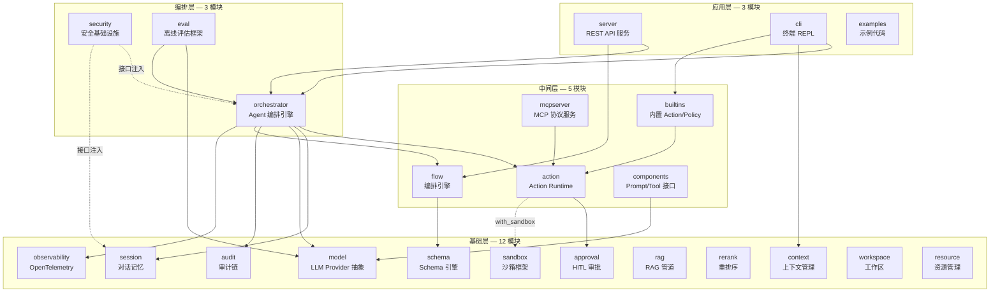
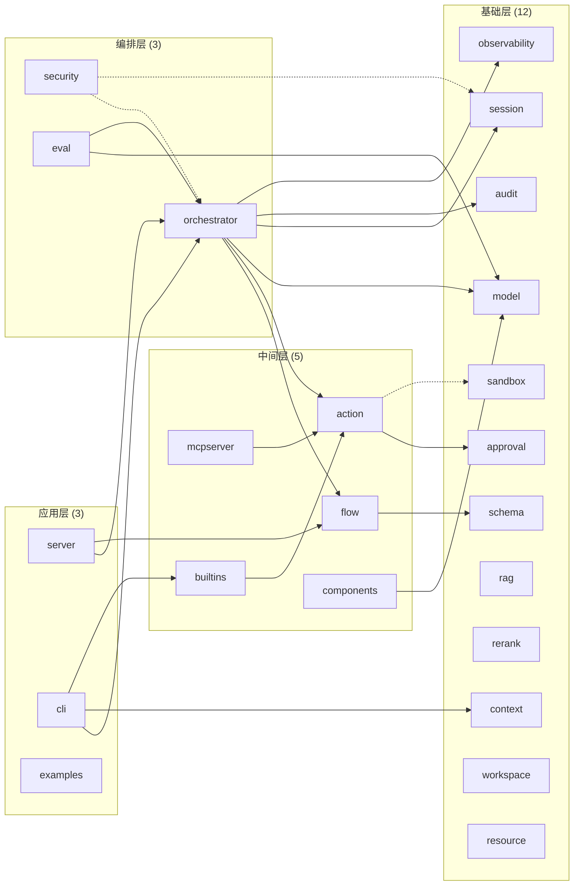
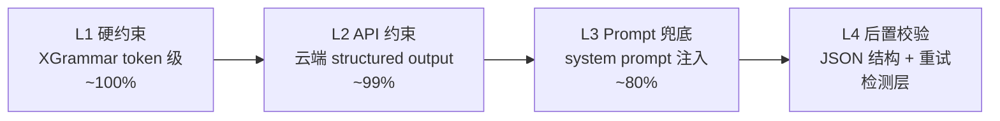
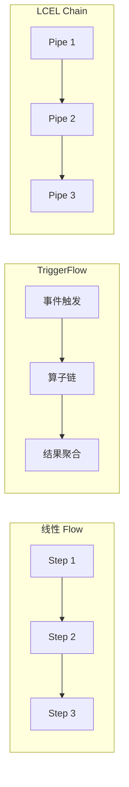
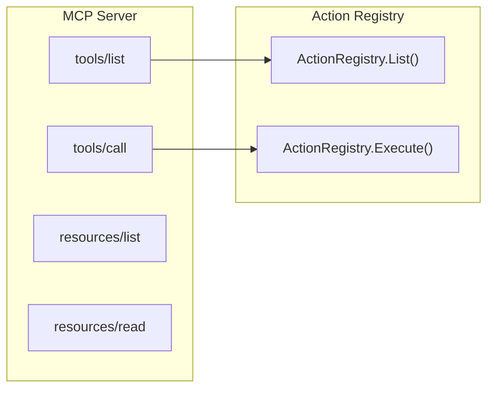
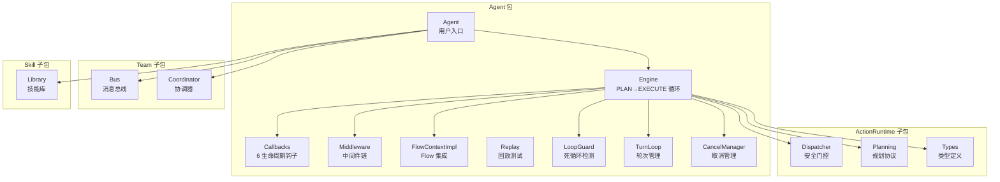
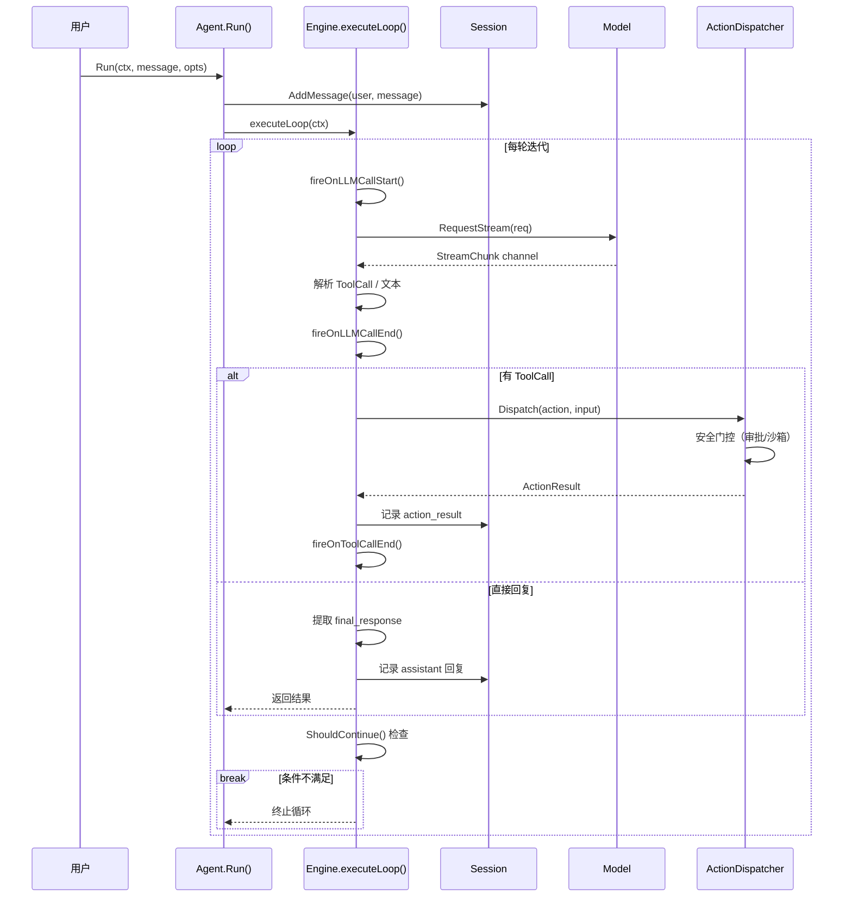
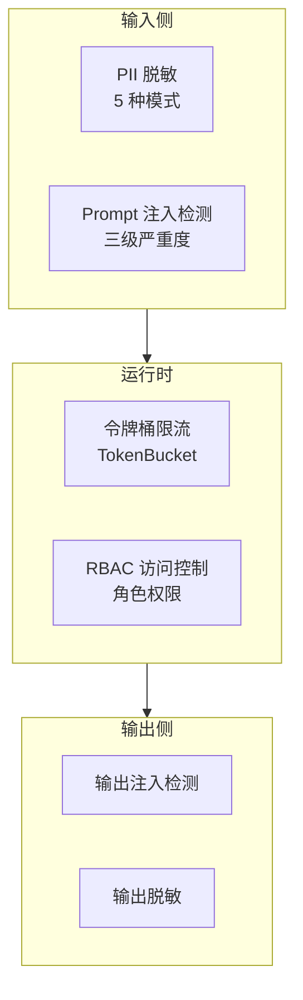
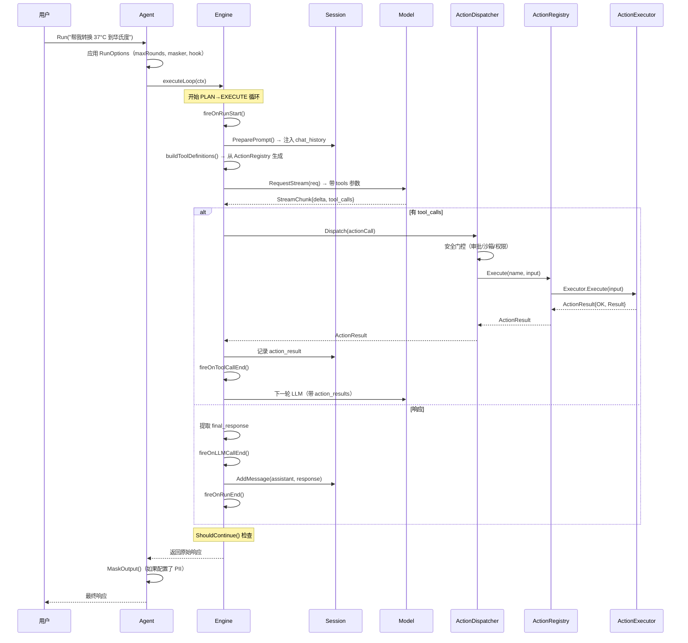

# Inferglow 架构深度分析

> 基于 graphify 知识图谱（8017 节点、17577 边、414 社区）自动生成架构分析。
> 生成日期：2026-07-31 | 源码地图：`graphify-out/graph.json` | 查询：`graphify query "<你的问题>"`

## 代码库地图

```
inferglow/                          ← 23 个独立 Go module，~62,000 LOC
│
├── 基础层（12 模块，零内部依赖）
│   ├── model/        ← LLM Provider 抽象 (~8000 LOC)
│   ├── schema/       ← 契约优先 Schema 引擎 (~2800 LOC)
│   ├── session/      ← 对话记忆管理 (~1800 LOC)
│   ├── sandbox/      ← 沙箱执行框架，8 种后端 (~6300 LOC)
│   ├── context/      ← 上下文管理引擎 (~6300 LOC)
│   ├── audit/        ← 链表式审计链 (~1100 LOC)
│   ├── approval/     ← HITL 审批 (~700 LOC)
│   ├── rag/          ← RAG 管道 (~1500 LOC)
│   ├── rerank/       ← 重排序 (~500 LOC)
│   ├── observability/← OpenTelemetry 集成 (~700 LOC)
│   ├── workspace/    ← 安全文件操作 (~1200 LOC)
│   └── resource/     ← 资源管理 (~750 LOC)
│
├── 中间层（5 模块，依赖基础层）
│   ├── components/   ← Prompt/Tool 通用接口 (~400 LOC)
│   ├── flow/         ← TriggerFlow + LCEL 编排引擎 (~7400 LOC)
│   ├── action/       ← Action 注册与执行 (~2900 LOC)
│   ├── mcpserver/    ← MCP 协议服务 (~850 LOC)
│   └── builtins/     ← 内置 Action/Policy/Tool (~2200 LOC)
│
├── 编排层（3 模块，聚合中间层+基础层）
│   ├── orchestrator/ ← Agent 编排层，用户入口 (~7700 LOC)
│   ├── security/     ← PII/注入/限流/RBAC (~2000 LOC)
│   └── eval/         ← 离线评估框架 (~750 LOC)
│
└── 应用层（3 模块，面向用户入口）
    ├── server/       ← REST API 服务 (~3100 LOC)
    ├── cli/          ← 终端 REPL 客户端 (~1200 LOC)
    └── examples/     ← 示例代码 (~2800 LOC)
```

### 开发者入口速查

| 你的目标 | 入口 |
|---------|------|
| 快速体验完整 Agent | `examples/example_quickstart.go` |
| 注册自定义工具 | `action/` 模块 + `action.New()` |
| 编排多步骤流程 | `flow/` 模块 + `flow.NewFlow().AddStep().Build()` |
| 启动 REST API 服务 | `server/cmd/inferglow-server/main.go` |
| 使用 CLI 终端 | `cli/cmd/inferglow-cli/main.go` |
| 调试 Agent 循环 | `orchestrator/agent/engine.go` → `executeLoop()` |
| 添加新 LLM Provider | `model/` → 实现 `ModelRequester` 接口 |

---

## 一、Session、Action、Flow 的关系澄清

---

## 目录

1. [项目概述与设计哲学](#1-项目概述与设计哲学)
2. [模块架构总览（四层 23 模块）](#2-模块架构总览四层-23-模块)
3. [基础层详解](#3-基础层详解)
4. [中间层详解](#4-中间层详解)
5. [编排层详解](#5-编排层详解)
6. [应用层详解](#6-应用层详解)
7. [横切关注点](#7-横切关注点)
8. [Graphify 知识图谱分析](#8-graphify-知识图谱分析)
9. [调用链全景分析](#9-调用链全景分析)
10. [设计模式与架构决策](#10-设计模式与架构决策)
11. [可插拔架构](#11-可插拔架构)
12. [质量属性与演进路线](#12-质量属性与演进路线)

---

## 1. 项目概述与设计哲学

### 1.1 定位

Inferglow 是一个 **Go 语言实现的 AI Agent 基础设施框架**，对标 Python [Agently](https://github.com/AgentEra/Agently) 的设计理念，提供一套可组合的模块化基础设施，为上层 AI Agent 应用提供支撑。

**核心差异：** 与 Python 生态的 Agently 相比，Inferglow 利用 Go 的静态类型系统、goroutine 并发模型和编译期校验，提供了更严格的契约保障和更优的运行性能。

### 1.2 设计哲学

| 原则 | 说明 | 代码体现 |
|------|------|---------|
| **契约优先** | Schema 定义先行，LLM 输出受四层校验约束 | `schema.OutputSchema` → L1-L4 校验链 |
| **可单测编排** | 每个 Flow Step 是纯 Go 函数，可独立单元测试 | `flow.StepFunc` 签名 `func(context.Context, any) (any, error)` |
| **模块化** | 23 个独立 Go module，零循环依赖 | Graphify 检测确认无 import cycle |
| **可扩展** | Provider/Executor/ResizeHandler 均通过接口扩展 | `model.ModelRequester`、`action.ActionExecutor` |
| **Go 适配** | goroutine 替代 async、泛型+反射替代 Pydantic | `goroutine + channel` 替代 `async/await` |
| **可选安全** | 沙箱和安全特性通过 build tag / 接口注入可选启用 | `//go:build with_sandbox` |

### 1.3 整体架构图



---

## 2. 模块架构总览（四层 23 模块）

### 2.1 模块矩阵

| 层级 | 模块数 | 总 LOC | 依赖方向 | 职责 |
|------|--------|--------|---------|------|
| **基础层** | 12 | ~25,000 | 零内部依赖 | 基础设施零件 |
| **中间层** | 5 | ~13,000 | 依赖基础层 | 组合基础设施 |
| **编排层** | 3 | ~11,000 | 聚合中间层+基础层 | 编排与安全 |
| **应用层** | 3 | ~7,000 | 依赖编排层 | 用户入口 |

### 2.2 完整模块清单



### 2.3 Graphify 验证的依赖健康度

Graphify 知识图谱分析确认：
- **无循环依赖**（Import Cycles: None detected）
- **8017 个节点**覆盖全部代码实体
- **17577 条边**反映真实依赖关系
- **80% EXTRACTED + 20% INFERRED** 边类型分布
- **414 个社区**对应模块级聚合

---

## 3. 基础层详解

### 3.1 model — LLM Provider 统一抽象

**模块路径：** `github.com/inferglow/model`
**依赖：** 无（仅 stdlib + yaml.v3）
**代码量：** ~8000 LOC

#### 核心类型

```go
// 核心接口
type ModelRequester interface {
    RequestModel(ctx context.Context, req *ModelRequest) (*ModelResponse, error)
}
type StreamRequester interface {
    ModelRequester
    RequestStream(ctx context.Context, req *ModelRequest) (<-chan StreamChunk, error)
}

// 请求/响应模型
type ModelRequest struct {
    Model       string
    Messages    []ChatMessage
    Tools       []ToolDefinition
    Output      *OutputSchema
    MaxTokens   int
    Temperature float64
    // ...
}
type ModelResponse struct {
    Content      string
    ToolCalls    []ToolCall
    Usage        *UsageInfo
    // ...
}
type StreamChunk struct {
    Delta        string
    ToolCalls    []ToolCall
    Reasoning    string
    ContentBlock *ContentBlock
    // ...
}
```

#### Provider 实现

| Provider | 协议 | 特点 |
|----------|------|------|
| `OpenAICompatibleProvider` | `/chat/completions` SSE | 兼容 OpenAI/DeepSeek/vLLM |
| `AnthropicCompatibleProvider` | `/messages` SSE | 兼容 Anthropic/SenseNova |
| `OllamaProvider` | `/api/chat` SSE | 本地模型 |
| `OpenAIResponsesProvider` | `/responses` | 新版 API |
| `FailoverModelRequester` | 组合模式 | 自动故障转移 |
| `ModelPool` | 连接池 | 多 Provider 轮转 |

#### Schema 四层校验



#### 流式归一化

`LeadingThinkNormalizer` 是一个三态状态机，分离 `  thinking` 推理内容：

```go
// 状态转换
type normalizerState int
const (
    stateNormal   normalizerState = iota  // 普通文本
    stateInThink                          // 处理中
    stateThinkDone                        // 已完成
)
```

**缓存预算：** `UsageInfo.PromptTokensDetails["cached_tokens"]` 回传 Prefix Cache 命中信息。

### 3.2 schema — Contract-First Schema 引擎

**模块路径：** `github.com/inferglow/schema`
**依赖：** 无（仅 yaml.v3）
**代码量：** ~2800 LOC

#### 核心类型

```go
type OutputSchema struct {
    Name        string
    Description string
    Properties  map[string]*FieldDef
    Required    []string
    // ...
}
type FieldDef struct {
    Name        string
    Type        DataType
    Description string
    Required    bool
    // ...
}
type ContractEngine struct { /* 编译期+运行时双重校验 */ }
```

#### 核心功能

| 功能 | 机制 | 用途 |
|------|------|------|
| 泛型推导 | `DefineOutput[T any]()` | 从 Go struct 生成 JSON Schema |
| JSON Schema 转换 | `BuildJSONSchemaFromOutput()` | Provider 的 `response_format` |
| 路径校验 | `ValidatePath()` | L4 后置校验 |
| JSON 提取 | `ExtractJSON()` | 从 LLM 响应中提取 |
| Blueprint 序列化 | `Blueprint` | 流式输出 Schema 持久化 |

### 3.3 session — 对话记忆管理

**模块路径：** `github.com/inferglow/session`
**依赖：** 无（安全特性通过 `MessageHook` 接口注入）
**代码量：** ~1800 LOC

#### 双列表架构

```go
type Session struct {
    FullContext    []ChatMessage  // 完整历史（永不裁剪）
    ContextWindow  []ChatMessage  // 当前窗口（可能被裁剪）
    // ...
}
type ChatMessage struct {
    Role    string
    Content []ContentBlock
    // ...
}
type ContentBlock struct {
    Type    string        // "text" | "image_url" | "tool_use" | "tool_result"
    Text    string
    Image   *ImageBlock
    ToolUse *ToolUseBlock
    // ...
}
```

#### 上下文窗口管理

| 策略 | 行为 | 适用场景 |
|------|------|---------|
| `SimpleCutResizeHandler` | 从前面丢弃，保留最近的 | 简单聊天 |
| `SummaryFirstResizeHandler` | 保留首条 + 末尾 2 条 + 中间摘要 | 需要保留系统提示 |
| `TokenAwareResizeHandler` | 按 token 估算裁剪 | 精确控制 token 预算 |
| `SmartCompressResizeHandler` | 智能压缩 | 复杂对话 |

#### 持久化接口

```go
type Memory interface {
    Load(ctx context.Context) ([]ChatMessage, error)
    Save(ctx context.Context, msgs []ChatMessage) error
    Clear(ctx context.Context) error
}
```

| 实现 | 说明 |
|------|------|
| `SummaryMemory` | Token 阈值触发自动摘要 |
| `TokenBufferMemory` | Token 预算裁剪历史 |
| `InMemoryStore` | 内存存储（server 模块） |

### 3.4 sandbox — 沙箱执行框架

**模块路径：** `github.com/inferglow/sandbox`
**依赖：** 无（完全独立）
**代码量：** ~6300 LOC

#### 8 种沙箱后端

| 后端 | Provider | 适用平台 | 隔离级别 |
|------|---------|---------|---------|
| Docker | `DockerProvider` | Linux | 容器级 |
| gVisor | `GVisorProvider` | Linux | 系统调用级 |
| 本地 | `LocalProvider` | 任意 | 无隔离 |
| TrustedLocal | `TrustedLocalProvider` | 任意 | 命令白名单 |
| Seatbelt | `SeatbeltProvider` | macOS | 系统调用级 |
| E2B | `E2BProvider` | 云 | 远程沙箱 |
| RestrictedToken | Windows | Windows | 进程级 |
| AppContainer | Windows | Windows | 容器级 |
| Windows Sandbox (WSB) | Windows | Windows | 虚拟机级 |

#### 核心接口

```go
type Provider interface {
    Name() string
    CreateHandle(ctx context.Context, policy ExecutionPolicy) (Handle, error)
}
type Handle interface {
    Execute(ctx context.Context, command Command) (ExecutionResult, error)
    Status() HandleStatus
    Close() error
}
type ExecutionPolicy struct {
    Mode         SandboxMode
    AllowedPaths []string
    Timeout      time.Duration
    Network      bool
    // ...
}
```

### 3.5 context — 上下文管理引擎

**模块路径：** `github.com/inferglow/context`
**依赖：** 无（完全独立）
**代码量：** ~6300 LOC

#### 三区压缩架构

```go
type HybridManager struct {
    HotZone    []ChatMessage    // 热区：最近 N 条
    WarmZone   []ChatMessage    // 温区：压缩后保留
    ColdZone   []ArchivedMessage // 冷区：摘要归档
    // ...
}
```

#### 核心功能

| 功能 | 说明 |
|------|------|
| Sweet-spot 自适应阈值 | 根据上下文长度动态调整 |
| Prefix Cache 预算 | `CacheBudgetUpdater` 回调 |
| 宪法区（Zone 0.5） | 不可变系统提示区域 |
| 三问重组 | 任务相关性重组 |
| 衰减预热 | 失效预热机制 |

### 3.6 audit — 链表式审计链

**模块路径：** `github.com/inferglow/audit`
**依赖：** 无
**代码量：** ~1100 LOC

#### 不可篡改审计

```go
type AuditChain struct {
    entries []AuditEntry
    // ...
}
type AuditEntry struct {
    ID        string
    PrevHash  string
    Data      string
    Timestamp time.Time
    Signature string
    // ...
}
```

- **SHA-256 哈希指针**：每个条目包含前一个条目的哈希
- **HMAC 签名**：可选签名验证
- **查询能力**：按时间/ID/类型查询

### 3.7 approval — HITL 审批

**模块路径：** `github.com/inferglow/approval`
**依赖：** 无
**代码量：** ~700 LOC

#### 核心类型

```go
type Manager struct {
    policies map[string]AccessPolicy
    // ...
}
type ApprovalRequest struct {
    ID       string
    Action   string
    Input    map[string]any
    Status   ApprovalStatus
    // ...
}
type AccessPolicy struct {
    AllowList []string
    DenyList  []string
    // ...
}
```

#### 内置审批处理器

| 处理器 | 行为 |
|--------|------|
| `AutoAllowHandler` | 自动允许 |
| `AutoApproveHandler` | 自动批准 |
| `FailClosedHandler` | 默认拒绝 |
| `InputTimeoutFailHandler` | 超时拒绝 |

### 3.8 rag — RAG 管道

**模块路径：** `github.com/inferglow/rag`
**依赖：** 无
**代码量：** ~1500 LOC

#### 管道架构

```go
type Pipeline struct {
    Loader    Loader
    Splitter  Splitter
    Embedding EmbeddingRegistry
    Store     DocumentStore
    // ...
}
```

| 组件 | 实现 |
|------|------|
| Loader (6 种) | CSV, JSON, HTML, Markdown, Text, Line |
| Splitter (3 种) | RecursiveCharacter, Markdown, Paragraph |
| Embedding | Registry 模式 |
| Retriever | BM25, Recency, Fusion |

### 3.9 rerank — 重排序

**模块路径：** `github.com/inferglow/rerank`
**依赖：** 无
**代码量：** ~500 LOC

```go
type Reranker interface {
    Rerank(ctx context.Context, query string, docs []Document) ([]Document, error)
}
```

| 后端 | 说明 |
|------|------|
| Cohere | Cohere Rerank API |
| LLM-based | 基于 LLM 的重排序 |
| Fallback | 降级策略 |

### 3.10 observability — OpenTelemetry 集成

**模块路径：** `github.com/inferglow/observability`
**依赖：** 无
**代码量：** ~700 LOC

#### 6 种 SpanKind

| SpanKind | 覆盖范围 |
|----------|---------|
| `SpanAgentRun` | Agent 运行 |
| `SpanLLMCall` | LLM 调用 |
| `SpanToolCall` | 工具调用 |
| `SpanFlowExecute` | Flow 执行 |
| `SpanStepExecute` | Step 执行 |
| `SpanInternal` | 内部操作 |

### 3.11 workspace — 工作区

**模块路径：** `github.com/inferglow/workspace`
**依赖：** 无
**代码量：** ~1200 LOC

```go
type Workspace struct {
    config Config
    // ...
}
```

| 功能 | 说明 |
|------|------|
| SafePath 三重防护 | 路径穿越防护 |
| ReadOnly 模式 | 只读保护 |
| 文件大小限制 | 防止大文件 |
| 文件数量限制 | 防止过多文件 |

### 3.12 resource — 资源管理

**模块路径：** `github.com/inferglow/resource`
**依赖：** 无
**代码量：** ~750 LOC

```go
type Provider interface {
    Name() string
    CreateHandle(ctx context.Context, requirement Requirement) (Handle, error)
}
type Manager struct {
    providers map[string]Provider
    // ...
}
```

---

## 4. 中间层详解

### 4.1 flow — 编排引擎

**模块路径：** `github.com/inferglow/flow`
**依赖：** `schema`
**代码量：** ~7400 LOC

#### 三层流引擎



#### Flow 核心类型

```go
type Flow struct {
    steps     map[string]*Step
    edges     []Edge
    branches  []Branch
    startStep *Step
    // 持久化配置
    autoCheckpoint  bool
    checkpointStore CheckpointStore
    // ...
}

type Step struct {
    Name   string
    Func   StepFunc
    Schema *schema.OutputSchema  // 可选，为 nil 时不校验
    // ...
}

type StepFunc func(context.Context, any) (any, error)
```

#### 13 种算子类型

| 算子 | 用途 |
|------|------|
| `chunk` | 数据分块 |
| `signal_gate` | 信号门控 |
| `batch_fanout` | 批量扇出 |
| `batch_collect` | 批量收集 |
| `for_each` | 循环执行 |
| `match_case` | 模式匹配 |
| `collect_branch` | 分支收集 |
| `action` | Action 调用 |
| `llm_call` | LLM 调用 |
| `sub_flow` | 子流程 |
| `intervention` | 人工干预 |
| `passthrough` | 透传 |
| `code_exec` | 代码执行 |

#### FlowContext 接口

```go
type FlowContext interface {
    ExecuteAction(ctx context.Context, name string, params map[string]any) (any, error)
    GenerateModel(ctx context.Context, system string, userMessage string) (string, error)
    SessionHistory() []map[string]any
    AppendSession(role string, content any)
    AuditAppend(source, action string, input, output any)
    SetValue(key string, value any)
    GetValue(key string) (any, bool)
    StartSpan(ctx context.Context, kind SpanKind, name string) (context.Context, Span)
    MaskInput(input string) string
    CheckOutput(output string) error
    RequestPause(reason string) error
    RunAgent(ctx context.Context, userMessage, systemPrompt string, opts *AgentRunOptions) (string, error)
    RunAgentParallel(ctx context.Context, agents []AgentSubTask) ([]string, error)
}
```

#### LCEL 声明式链

```go
// 线性管道
chain := flow.LCEL().Pipe(step1).Pipe(step2).Pipe(step3).Build()

// Map 变换
chain := flow.LCEL().Map(func(v any) any { return v }).Build()

// 分支
chain := flow.LCEL().Branch(cond, trueBranch, falseBranch).Build()

// 并行
chain := flow.LCEL().Parallel(chain1, chain2).Build()
```

#### Pause/Resume 机制

```go
// 暂停
type ExecutionPersistence struct {
    Serializer  Serializer
    Store       CheckpointStore
    // ...
}
type FileCheckpointStore struct { /* 文件系统实现 */ }

// 快照
type ExecutionSnapshot struct {
    FlowName    string
    State       map[string]any
    CurrentStep string
    Errors      []string
    // ...
}
```

### 4.2 action — Action Runtime

**模块路径：** `github.com/inferglow/action`
**依赖：** `approval`（`sandbox` 通过 `with_sandbox` build tag 可选）
**代码量：** ~2900 LOC

#### 核心类型

```go
type Action struct {
    Name        string
    Description string
    Schema      map[string]any
    Executor    ActionExecutor
    Tags        []string
}

type ActionRegistry struct {
    actions map[string]*Action
    mu      sync.RWMutex
    // ...
}

type ActionResult struct {
    OK       bool
    Status   string   // "success" | "error" | "blocked"
    Result   any
    Error    string
    // ...
}
```

#### 三种执行器

| 执行器 | 说明 | 编译标签 |
|--------|------|---------|
| `LocalFunctionExecutor` | 三种签名自动包装 | 默认 |
| `MCPExecutor` | 远程 MCP 协议客户端 | 默认 |
| `SandboxExecutor` | 沙箱执行器 | `with_sandbox` |

#### 三种函数签名自动包装

```go
// 签名 1: 标准
func(ctx context.Context, input InputT) (OutputT, error)

// 签名 2: 简化
func(input InputT) (OutputT, error)

// 签名 3: 仅输出
func(ctx context.Context, input InputT) OutputT
```

### 4.3 components — Prompt/Tool 接口

**模块路径：** `github.com/inferglow/components`
**依赖：** `model`
**代码量：** ~400 LOC

```go
// Prompt 模板
type ChatTemplate interface {
    Format(input map[string]any) ([]model.ChatMessage, error)
}
```

| 实现 | 说明 |
|------|------|
| `FewShotTemplate` | Few-shot 示例模板 |
| `SystemTemplate` | 系统提示模板（条件段） |
| `StringTemplate` | 字符串模板 |

### 4.4 mcpserver — MCP 协议服务

**模块路径：** `github.com/inferglow/mcpserver`
**依赖：** `action`
**代码量：** ~850 LOC

#### 三种传输

| 传输 | 协议 | 适用场景 |
|------|------|---------|
| `StdioTransport` | 标准输入输出 | 本地进程通信 |
| `SSETransport` | GET `/sse` + POST `/messages` | 远程服务 |
| `StreamableHTTPTransport` | POST `/mcp` | HTTP 流式 |

#### MCP 协议映射



### 4.5 builtins — 内置 Action

**模块路径：** `github.com/inferglow/builtins`
**依赖：** `action`
**代码量：** ~2200 LOC

| 内置 Action | 说明 |
|-------------|------|
| `NewBashExecutorAction` | Bash 命令执行 |
| `NewCodeExecutorAction` | 代码执行 |
| `NewCalculatorAction` | 算术计算 |
| `NewURLFetchAction` | URL 抓取 |
| `NewFileReadAction` | 文件读取 |
| `NewFileWriteAction` | 文件写入 |
| `NewWebSearchAction` | 网络搜索 |
| `NewMemoryRememberAction` | 记忆存储 |
| `NewMemoryForgetAction` | 记忆删除 |
| `NewJSONProcessorAction` | JSON 处理 |

---

## 5. 编排层详解

### 5.1 orchestrator — Agent 编排层

**模块路径：** `github.com/inferglow/orchestrator`
**依赖：** `action`, `audit`, `flow`, `model`, `observability`, `session`
**代码量：** ~7700 LOC

#### 核心架构



#### Agent 结构

```go
type Agent struct {
    session      *SessionExtension
    actionExt    *ActionExtension
    engine       *Engine
    maxRounds    int
    systemPrompt string
    streamTimeout time.Duration
    outputHook   OutputSecurityHook
    piiMasker    PIIMasker
    features     Features
    callbacks    *AgentCallbacks
    middlewares  []Middleware
    // ...
}
```

#### 配置选项

| 选项 | 类型 | 默认值 | 说明 |
|------|------|--------|------|
| `WithMaxRounds` | int | 10 | 最大迭代轮数 |
| `WithSystemPrompt` | string | "" | 系统提示词 |
| `WithStreamTimeout` | duration | 5min | 流超时 |
| `WithOutputSecurityHook` | interface | nil | 输出安全钩子 |
| `WithPIIMasker` | interface | nil | PII 脱敏 |
| `WithFeatures` | struct | 默认 | 功能开关 |
| `WithCallbacks` | struct | nil | 生命周期回调 |
| `WithMiddleware` | []Middleware | nil | 中间件链 |

#### executeLoop 执行流程



#### 循环控制条件

```go
func shouldContinue(decision Decision, roundIndex int, maxRounds int) bool {
    if maxRounds > 0 && roundIndex >= maxRounds {
        return false      // 达到最大轮数
    }
    if decision.NextAction != "execute" {
        return false      // LLM 决定直接回复
    }
    if !decision.UseAction {
        return false      // 不需要使用 action
    }
    return len(decision.ActionCalls) > 0  // 有可执行的 action
}
```

#### 死循环检测（LoopGuard）

```go
type LoopGuard struct {
    config    LoopGuardConfig
    roundLog  []RoundRecord
    // ...
}

type LoopGuardConfig struct {
    MaxConsecutiveIdenticalActions int  // 连续相同 Action 上限
    MaxConsecutiveErrors           int  // 连续错误上限
    MaxTotalRounds                 int  // 总轮数上限
    // ...
}
```

#### 三种取消安全点

| 安全点 | 触发时机 | 行为 |
|--------|---------|------|
| LLM 调用前 | `executeLoop` 开始 | 检查 ctx 取消 |
| Action 执行前 | `Dispatcher.Execute` | 检查 ctx 取消 |
| 状态更新前 | 每轮迭代结束 | 检查 ctx 取消 |

#### 6 个生命周期回调

```go
type AgentCallbacks struct {
    OnRunStart        func(ctx context.Context, input string)
    OnRunEnd          func(ctx context.Context, output string, err error)
    OnLLMCallStart    func(ctx context.Context, req *model.ModelRequest)
    OnLLMCallEnd      func(ctx context.Context, resp *model.ModelResponse, err error)
    OnToolCallStart   func(ctx context.Context, call ActionCall)
    OnToolCallEnd     func(ctx context.Context, result *ActionResult, err error)
    // 扩展
    OnReasoning       func(ctx context.Context, reasoning string)
    OnToken           func(ctx context.Context, token string)
    OnApprovalRequired func(ctx context.Context, action ActionCall)
    OnCompression     func(ctx context.Context, before, after int)
}
```

#### CallbacksTracer 桥接

`CallbacksTracer` 将 `AgentCallbacks` 桥接到 OpenTelemetry span：

| 回调 | OTel Span |
|------|-----------|
| `OnRunStart` | `SpanAgentRun` |
| `OnLLMCallStart` | `SpanLLMCall` |
| `OnToolCallStart` | `SpanToolCall` |

#### Flow Context 实现

`flowContextImpl` 是 `flow.FlowContext` 的实现，注入到 `flow.Execute` 中：

```go
type flowContextImpl struct {
    engine    *Engine
    session   *SessionExtension
    actionExt *ActionExtension
    auditHook audit.AuditHook
    // ...
}
// 编译期断言
var _ flow.FlowContext = (*flowContextImpl)(nil)
```

#### executeFlow 路径

`executeFlow` 是 Agent 的 Flow 执行路径，与 `executeLoop` 互补：

```go
func (a *Agent) executeFlow(ctx context.Context, userMessage string, fc flow.FlowContext) (string, error) {
    // 1. 注入 FlowContext
    ctx = flow.WithFlowContext(ctx, fc)
    // 2. 执行 Flow
    result, err := a.flow.Execute(ctx, userMessage)
    // 3. 处理结果
    return result, err
}
```

### 5.2 security — 安全基础设施

**模块路径：** `github.com/inferglow/security`
**依赖：** `session`（`sessionhook`）、`orchestrator`（`agenthook`）— 接口注入
**代码量：** ~2000 LOC

#### 四层安全框架



#### 接口注入模式

| 接口 | 定义位置 | 实现位置 | 注入入口 |
|------|---------|---------|---------|
| `session.MessageHook` | `session/` | `security/sessionhook/` | `session.WithSecurityHook()` |
| `agent.OutputSecurityHook` | `orchestrator/agent/` | `security/agenthook/` | `agent.WithOutputSecurityHook()` |
| `agent.PIIMasker` | `orchestrator/agent/` | `security/agenthook/` | `agent.WithPIIMasker()` |

#### 依赖方向

```
security/sessionhook  →  session              （MessageHook 实现）
security/agenthook    →  orchestrator/agent   （OutputSecurityHook / PIIMasker 实现）
security/agenthook    →  security/pii         （适配 *pii.Masker）
security/sessionhook  →  security/prompt_injection
```

### 5.3 eval — 离线评估框架

**模块路径：** `github.com/inferglow/eval`
**依赖：** `model`, `session`, `action`, `orchestrator`
**代码量：** ~750 LOC

#### 核心类型

```go
type Suite struct {
    Cases []Case
    // ...
}
type Case struct {
    Name     string
    Input    string
    Expected ExpectedOutput
    // ...
}
type Runner struct {
    suite    Suite
    provider *ScriptedProvider
    // ...
}
```

#### ScriptedProvider

`ScriptedProvider` 实现 `model.ModelRequester`，基于预录响应进行回放测试：

```go
type ScriptedProvider struct {
    responses []ScriptedResponse
    // ...
}
```

#### 断言类型

| 断言 | 说明 |
|------|------|
| `Contains` | 包含子串 |
| `NotContains` | 不包含子串 |
| `ToolSequence` | 工具调用顺序匹配 |

---

## 6. 应用层详解

### 6.1 server — REST API 服务

**模块路径：** `github.com/inferglow/server`
**依赖：** `flow`（数据模型）, `orchestrator`（Agent 执行）
**代码量：** ~3100 LOC

#### 架构

```go
type Server struct {
    cfg        Config
    mux        *http.ServeMux
    httpServer *http.Server
    agentStore AgentStore
    tenantMgr  *TenantManager
    // ...
}
```

#### API 路由

| 路径 | 方法 | 说明 |
|------|------|------|
| `/v1/chat/completions` | POST | 聊天补全 |
| `/v1/flows` | POST | 创建 Flow |
| `/v1/flows/:id` | GET | 查询 Flow |
| `/v1/flows/:id/execute` | POST | 执行 Flow |
| `/v1/flows/:id/pause` | POST | 暂停 Flow |
| `/v1/flows/:id/resume` | POST | 恢复 Flow |
| `/v1/flows/:id/state` | GET | 运行时状态 |
| `/v1/flows/:id/steps` | GET | 步骤状态 |
| `/v1/memory` | GET/POST | 持久化 Memory CRUD |
| `/v1/memory/:id` | GET/DELETE | Memory 操作 |
| `/v1/triggers` | GET/POST | 触发器管理 |
| `/v1/triggers/:id` | DELETE | 删除触发器 |
| `/v1/health` | GET | 健康检查 |
| `/v1/openapi.json` | GET | OpenAPI 3.0 规范 |

#### 外部触发器

| 触发器 | 说明 | 配置 |
|--------|------|------|
| `WebhookTrigger` | Webhook 回调 | HMAC 验签 |
| `CronTrigger` | 定时触发 | Cron 表达式 |
| `EventTrigger` | 事件驱动 | EventBus |

#### 流式工具调用

```go
type ToolStreamEvent struct {
    Type    string          // "step_done" | "tool_call" | "tool_result"
    Data    json.RawMessage
    // ...
}
```

### 6.2 cli — 终端 REPL 客户端

**模块路径：** `github.com/inferglow/cli`
**依赖：** `orchestrator`, `action`, `builtins`, `context`, `model`, `session`
**代码量：** ~1200 LOC

#### 核心功能

```go
type CLIConfig struct {
    Model      string
    MaxRounds  int
    // ...
}
type MemoryBridge struct {
    hybridManager *context.HybridManager
    store         *Store
    // ...
}
```

| 功能 | 说明 |
|------|------|
| 交互式 REPL | 多轮对话 |
| 持久记忆注入 | `MemoryBridge` 自动注入 |
| 上下文压缩 | `/compact` 命令 |
| 宪法区加载 | 系统提示保护 |
| 会话恢复 | 从文件恢复 |
| 内置命令 | `/help`, `/memory`, `/compact`, `/quit` |

### 6.3 examples — 示例代码

**模块路径：** `github.com/inferglow/examples`
**依赖：** 多模块
**代码量：** ~2800 LOC

---

## 7. 横切关注点

### 7.1 FlowContext 横切接口

FlowContext 在 `flow` 包中定义了 7 个横切方法，通过 `context.Context` 值注入：

```mermaid
graph LR
    subgraph FC["FlowContext（flow 包定义）"]
        EA["ExecuteAction"]
        GM["GenerateModel"]
        SH["SessionHistory"]
        AS["AppendSession"]
        AA["AuditAppend"]
        SV["SetValue/GetValue"]
        SS["StartSpan"]
        MI["MaskInput"]
        CO["CheckOutput"]
        RP["RequestPause"]
        RA["RunAgent"]
        RAP["RunAgentParallel"]
    end
    subgraph Impl["flowContextImpl（orchestrator 实现）"]
        ENG["Engine"]
        SES["SessionExtension"]
        ACR["ActionExtension"]
        AH["AuditHook"]
    end
    FC --> Impl
```



### 7.2 小接口拆分

FlowContext 中的横切方法已拆分为独立小接口，通过 context 值传递：

| 小接口 | Getter | 未注入时 |
|--------|--------|---------|
| `AuditHook` | `AuditHookFrom(ctx)` | noop |
| `SecurityHook` | `SecurityHookFrom(ctx)` | noop |
| `SpanStarterHook` | `SpanStarterHookFrom(ctx)` | noop |
| `KVStore` | `KVStoreFrom(ctx)` | noop |

### 7.3 暂停信号机制

```go
// 注入通道
ctx = flow.WithPauseSignal(ctx, pauseCh)

// 检查
ch, ok := flow.PauseSignalFrom(ctx)
select {
case <-ch:
    // 暂停执行
default:
    // 继续
}
```

---

## 8. Graphify 知识图谱分析

### 8.1 图谱概览

| 指标 | 值 |
|------|-----|
| 节点数 | 8017 |
| 边数 | 17577 |
| 社区数 | 414 |
| 边类型分布 | 80% EXTRACTED + 20% INFERRED |
| 循环依赖 | 无 |

### 8.2 God Nodes（架构枢纽）

Graphify 识别的最高连接度节点，反映架构核心抽象：

| 排名 | 节点 | 边数 | 含义 |
|------|------|------|------|
| 1 | `NewSession()` | 148 | Session 创建：跨模块最大连接枢纽 |
| 2 | `DefaultPolicy()` | 101 | 默认策略：沙箱策略配置中心 |
| 3 | `NewActionExtension()` | 100 | Action 扩展：Agent 初始化核心 |
| 4 | `New()` | 84 | 通用构造器 |
| 5 | `NewFlow()` | 74 | Flow 构造器 |
| 6 | `Request` | 68 | HTTP 请求模型 |
| 7 | `NewModelPool()` | 65 | 模型池构造器 |
| 8 | `NewStep()` | 64 | Flow Step 构造器 |
| 9 | `NewSignalNet()` | 61 | 信号网络构造器 |
| 10 | `NewSessionExtension()` | 52 | Session 扩展构造器 |

### 8.3 社区结构

Graphify 将 8017 个节点聚类为 414 个社区，以下是主要社区：

| 社区 | 节点数 | 内聚度 | 内容 |
|------|--------|--------|------|
| Store | 20 | 0.04 | 存储相关 |
| NewSession | 70 | 0.08 | Session 创建+测试 |
| NewTurnLoop | 49 | 0.06 | 轮次管理 |
| Operator | 34 | 0.05 | Flow 算子 |
| DefaultPolicy | 56 | 0.08 | 沙箱策略 |
| Agent | 28 | 0.08 | Agent 核心 |
| Engine | 26 | 0.09 | Engine 测试 |
| .executeLoop | 21 | 0.21 | 核心循环 |
| FlowContext | 11 | 0.55 | **最高内聚** |
| Chain | 7 | 0.54 | Middleware 链 |

### 8.4 跨社区桥接

| 节点 | 桥接社区 | 中介中心性 |
|------|---------|-----------|
| `ReadAll()` | 多个社区 | 0.101 |
| `NewSession()` | 多个社区 | 0.091 |
| `buildAgent()` | 多个社区 | 0.086 |

### 8.5 出乎意料的连接

Graphify 识别的 INFERRED 边揭示了跨模块连接：

| 连接 | 跨模块 | 置信度 |
|------|--------|--------|
| `NewMemoryBridge()` → `NewStore()` | cli → skill | INFERRED |
| `newTestManager()` → `NewManager()` | action → sandbox | INFERRED |
| `TestSandboxExecutor*` → `NewPolicyApprovalManager()` | action → approval | INFERRED |

---

## 9. 调用链全景分析

### 9.1 端到端 Agent 调用链



### 9.2 13 条端到端调用链

| 序号 | 调用链 | 涉及模块 | 说明 |
|------|--------|---------|------|
| 1 | 用户输入 → Agent → Session → Model → 响应 | session, model, orchestrator | 基础对话 |
| 2 | 用户输入 → Agent → Session → Model → Action → 结果 → 下一轮 LLM → 响应 | session, model, action, orchestrator | 工具调用 |
| 3 | Action → ActionDispatcher → 审批 → Sandbox → 执行 → 结果 | approval, sandbox, action | 沙箱执行 |
| 4 | Flow → Step → StepFunc → FlowContext → 结果 | flow, schema | Flow 执行 |
| 5 | Flow → TriggerFlow → Operator → SignalNet → 结果 | flow | 事件驱动 |
| 6 | Server → Agent → Flow → 结果 | server, flow, orchestrator | REST API |
| 7 | Server → Trigger → Webhook/Cron/Event → Agent → 结果 | server, trigger | 外部触发 |
| 8 | Server → SSE → StreamCallbacks → 流式结果 | server | 流式输出 |
| 9 | CLI → REPL → Agent → 结果 | cli, orchestrator | 终端交互 |
| 10 | CLI → MemoryBridge → Context → Session | cli, context, session | 记忆注入 |
| 11 | Eval → Suite → ScriptedProvider → Agent → 断言 | eval, model, orchestrator | 离线评估 |
| 12 | MCP → tools/list → ActionRegistry → 响应 | mcpserver, action | MCP 协议 |
| 13 | Security → MessageHook → Session → Agent → OutputHook → 响应 | security, session, orchestrator | 安全链路 |

### 9.3 错误传播

| 错误类型 | 源头 | 传播路径 | 处理方式 |
|---------|------|---------|---------|
| LLM 超时 | model | → engine → agent | 记录错误，重试 |
| Action 执行错误 | action | → dispatcher → engine | 记录错误，继续 |
| 审批拒绝 | approval | → dispatcher → engine | 标记 blocked |
| 沙箱错误 | sandbox | → executor → dispatcher → engine | 标记 error |
| 注入检测 | security | → hook → session/agent | 阻断/记录 |
| 死循环 | loopGuard | → engine | 终止循环 |
| 流超时 | engine | → executeLoop | 超时退出 |

---

## 10. 设计模式与架构决策

### 10.1 设计模式清单

| 模式 | 使用位置 | 说明 |
|------|---------|------|
| **接口注入** | security → session/orchestrator | 可选安全特性，不注入即零开销 |
| **Build Tag** | action → sandbox | `//go:build with_sandbox` 可选编译 |
| **策略模式** | session.ResizeHandler | 3 种裁剪策略可互换 |
| **工厂模式** | model.ProviderFactory | 从配置创建 Provider |
| **组合模式** | model.FailoverModelRequester | 组合多个 ModelRequester |
| **观察者模式** | flow.SignalNet | 事件驱动信号网络 |
| **责任链模式** | orchestrator/middleware | 中间件链（与 echo/gin 类似） |
| **模板方法** | flow.Step → StepFunc | 步骤执行框架 |
| **适配器模式** | security/agenthook | PIIMasker 适配 |
| **Builder 模式** | flow.NewFlow().AddStep().To().Build() | 链式构建 |
| **Registry 模式** | action.ActionRegistry | 动作注册发现 |
| **哨兵错误** | flow.ErrPauseRequested | 暂停信号 |

### 10.2 关键架构决策

| 决策 | 选择 | 替代方案 | 理由 |
|------|------|---------|------|
| 模块拆分粒度 | 23 个独立 Go module | 大单体 | 独立发布、测试、复用 |
| 依赖方向 | 严格单向（基础层→中间层→编排层→应用层） | 双向依赖 | 避免循环依赖 |
| 安全架构 | 接口注入 + Build Tag | 编译时选择 | 零开销不使用时 |
| FlowContext | 接口定义在 flow 包，实现在 orchestrator | 直接依赖 | 避免 flow 依赖 orchestrator |
| 持久化 | 文件系统（FileCheckpointStore） | 数据库 | 零配置，简单部署 |
| 传输协议 | MCP JSON-RPC 2.0 | 自定义协议 | 标准协议，可互操作 |
| 序列化 | JSON/YAML | Protobuf | 可读性优先 |
| 流式处理 | channel-based | callback-based | goroutine 天然适配 |

### 10.3 Go 语言适配对照

| Python 特性 | Go 适配方案 |
|------------|------------|
| ContextVar | `context.Context` + 值传递 |
| Pydantic TypeAdapter | Go 泛型 + 反射 + JSON Schema |
| 装饰器 (@agent.tool_func) | Go func + 显式注册 |
| async/await | goroutine + channel |
| TypedDict | Go struct |
| Protocol (typing) | Go interface |
| asyncio.Event/Lock | Go channel + sync.Mutex |
| pip module | Go module + go.mod replace |

---

## 11. 可插拔架构

### 11.1 编译配置决策树

```
是否需要沙箱执行？
├── 是 → go build -tags with_sandbox ./...
└── 否 → go build ./...（默认，体积更小）

是否需要安全特性（PII/注入检测）？
├── 是 → 在 orchestrator 层注入 sessionhook/agenthook
└── 否 → 不注入，零开销
```

### 11.2 Build Tags 机制

`action/executor_sandbox.go` 通过 `//go:build with_sandbox` 标签隔离：

```go
//go:build with_sandbox

package action

func NewSandboxExecutor(config SandboxExecutorConfig) *SandboxExecutor {
    // 完整实现
}
```

`action/executor_sandbox_stub.go` 在 `!with_sandbox` 下提供占位：

```go
//go:build !with_sandbox

package action

func NewSandboxExecutor(config SandboxExecutorConfig) *SandboxExecutor {
    return &SandboxExecutor{} // 调用 Execute 返回错误
}
```

### 11.3 接口注入模式

```
session 和 orchestrator/agent 对 security 完全无感知，不注入即零开销。
```

```go
// 启用安全特性（无需特殊编译）
sess := session.NewSessionWithOptions("id", 4000,
    session.WithSecurityHook(secHook),
)
ag := agent.New(sess, actExt, llm,
    agent.WithOutputSecurityHook(outHook),
    agent.WithPIIMasker(piiMasker),
)
```

---

## 12. 质量属性与演进路线

### 12.1 质量属性

| 属性 | 度量 | 当前状态 |
|------|------|---------|
| 模块化 | 独立 Go module 数 | 23 |
| 可测试性 | 测试文件数 | 200+ |
| 可扩展性 | 接口扩展点 | 7 种（Provider/Executor/ResizeHandler 等） |
| 安全性 | 安全层 | 4 层（PII/注入/限流/RBAC） |
| 性能 | 并发模型 | goroutine + channel |
| 可观测性 | SpanKind 数 | 6 种 |
| 可维护性 | 循环依赖 | 无 |

### 12.2 演进路线

```
Phase 1 (V1-V3): 基础设施零件
    model/schema/flow/action/session/sandbox 独立模块

Phase 2 (V4-V5): 编排层
    orchestrator + security + context 管理

Phase 3 (V6): 6-Wave 优化
    Middleware/Callbacks/Memory/解耦/RateLimit/并行

Phase 4 (V7): 能力补齐
    触发器/LCEL/Memory/状态检查/流式

Phase 5 (V8+): 上层产品化
    CLI Agent → 桌面端 → 全平台 AI 助理
```

### 12.3 待增强方向

| 方向 | 优先级 | 说明 |
|------|--------|------|
| Multi-Agent 协作 | P1 | Host-Specialist 路由 + 任务委派 |
| 向量检索 | P1 | Embedding-based 语义检索 |
| IM Bridge | P2 | Telegram/飞书/QQ/微信 |
| 桌面端 | P2 | Tauri/Wails 桌面壳 |
| 插件系统 | P3 | 约定优先插件 + 两级权限 |

---

## 附录

### A. 模块 LOC 统计

| 模块 | 路径 | 代码量 |
|------|------|--------|
| model | `github.com/inferglow/model` | ~8000 |
| sandbox | `github.com/inferglow/sandbox` | ~6300 |
| context | `github.com/inferglow/context` | ~6300 |
| orchestrator | `github.com/inferglow/orchestrator` | ~7700 |
| flow | `github.com/inferglow/flow` | ~7400 |
| server | `github.com/inferglow/server` | ~3100 |
| action | `github.com/inferglow/action` | ~2900 |
| schema | `github.com/inferglow/schema` | ~2800 |
| examples | `github.com/inferglow/examples` | ~2800 |
| builtins | `github.com/inferglow/builtins` | ~2200 |
| security | `github.com/inferglow/security` | ~2000 |
| session | `github.com/inferglow/session` | ~1800 |
| rag | `github.com/inferglow/rag` | ~1500 |
| workspace | `github.com/inferglow/workspace` | ~1200 |
| cli | `github.com/inferglow/cli` | ~1200 |
| audit | `github.com/inferglow/audit` | ~1100 |
| mcpserver | `github.com/inferglow/mcpserver` | ~850 |
| resource | `github.com/inferglow/resource` | ~750 |
| eval | `github.com/inferglow/eval` | ~750 |
| observability | `github.com/inferglow/observability` | ~700 |
| approval | `github.com/inferglow/approval` | ~700 |
| rerank | `github.com/inferglow/rerank` | ~500 |
| components | `github.com/inferglow/components` | ~400 |
| **总计** | | **~62,000** |

### B. Graphify 命令参考

```bash
# 构建知识图谱（仅代码）
graphify <path> --code-only

# 查询架构
graphify query <path> "问题" --graph graphify-out/graph.json

# 查看 God Nodes
graphify god-nodes --top 20 --graph graphify-out/graph.json

# 最短路径分析
graphify path <path> "NodeA" "NodeB" --graph graphify-out/graph.json

# 节点解释
graphify explain <path> "NodeName" --graph graphify-out/graph.json

# 更新图谱
graphify update <path>
```

### C. 架构文档索引

| 文档 | 位置 | 内容 |
|------|------|------|
| 本文件 | `ARCHITECTURE.md` | 架构深度分析 |
| 系统分析 01 | `docs/system-analysis/01-architecture-overview.md` | 分层架构全景 |
| 系统分析 02 | `docs/system-analysis/02-model-and-schema.md` | Model + Schema |
| 系统分析 03 | `docs/system-analysis/03-flow.md` | Flow 引擎 |
| 系统分析 04 | `docs/system-analysis/04-action-and-mcp.md` | Action + MCP |
| 系统分析 05 | `docs/system-analysis/05-session-sandbox-audit.md` | Session + Sandbox + Audit |
| 系统分析 06 | `docs/system-analysis/06-security-observability-workspace.md` | 安全 + 可观测 + 工作区 |
| 系统分析 07 | `docs/system-analysis/07-orchestrator.md` | Orchestrator |
| 系统分析 08 | `docs/system-analysis/08-call-chains.md` | 调用链 |
| 扩展机制 | `docs/EXTENDING.md` | 7 种扩展机制 |

---

*本文档由 Inferglow 源码分析 + Graphify 知识图谱（8017 节点，17577 边）联合生成*