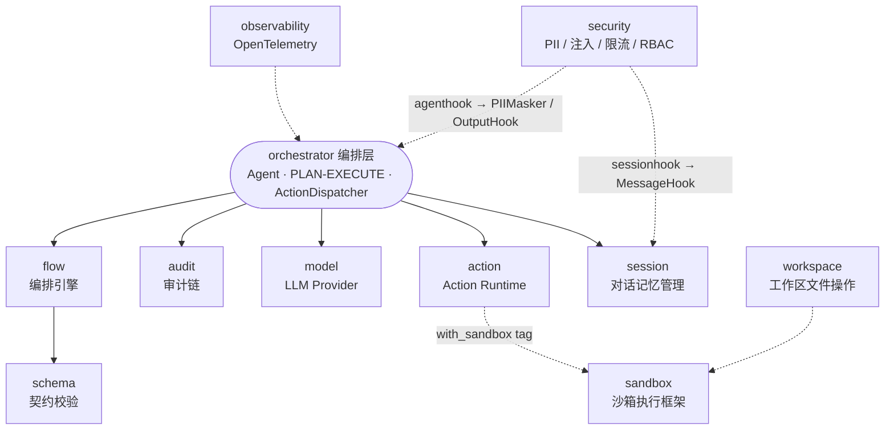
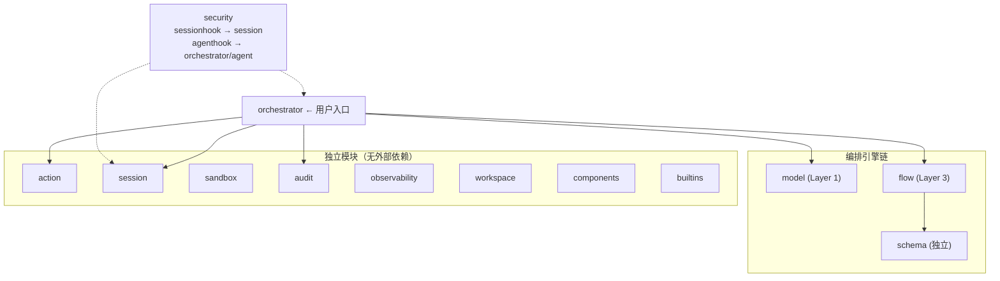

# Inferglow

Go 语言实现的 AI Agent 基础设施框架，对标 [Agently](https://github.com/AgentEra/Agently)（Python）的设计理念。

## 为什么

Go 生态缺乏一个对标 Agently 设计理念的框架：**契约优先、可单测编排、内置沙箱、明确的 Pause/Resume/Persist 能力**。Inferglow 提供一套可组合的基础设施模块，为上层 AI Agent 框架（inferglow）提供支撑。

## 架构概览



> **实线** = 编译时直接依赖　|　**虚线** = 可选依赖（build tag / 接口注入）

## 可插拔架构 (Pluggable Architecture)

Inferglow 自 v2 起将沙箱执行与安全特性改造为**可选依赖**，让核心编排层默认保持最小体积、零安全开销，需要时再通过编译标签或接口注入按需启用。

### 1. Build Tags 机制（沙箱可选）

`action/executor_sandbox.go` 通过 `//go:build with_sandbox` 标签隔离，配套的 `action/executor_sandbox_stub.go` 在 `!with_sandbox` 下提供占位实现（调用 `Execute` 时返回明确错误）。默认编译不会引入 `github.com/inferglow/sandbox` 依赖。

```bash
# 默认模式（推荐）：不打包沙箱，体积更小
go build ./...

# 沙箱模式：打包完整沙箱后端
go build -tags with_sandbox ./...
```

### 2. 接口注入模式（安全可选）

`session` 与 `orchestrator/agent` 不再直接 import `security`，只保留接口契约：

| 接口 | 定义位置 | 实现位置 | 注入入口 |
|------|---------|---------|---------|
| `session.MessageHook` | `session/security_hook.go` | `security/sessionhook.SecurityHook` | `session.WithSecurityHook(hook)` |
| `agent.OutputSecurityHook` | `orchestrator/agent/security_hook.go` | `security/agenthook.OutputInjectionHook` | `agent.WithOutputSecurityHook(hook)` |
| `agent.PIIMasker` | `orchestrator/agent/agent.go` | `security/agenthook.PIIMasker`（适配 `pii.Masker`） | `agent.WithPIIMasker(m)` |

依赖方向严格单向：`security/sessionhook → session`，`security/agenthook → orchestrator/agent`。不注入即零开销。

### 3. 编译配置决策树

```
是否需要沙箱执行？
├── 是 → go build -tags with_sandbox ./...
└── 否 → go build ./...（默认，体积更小）

是否需要安全特性（PII/注入检测）？
├── 是 → 在 orchestrator 层注入 sessionhook/agenthook
└── 否 → 不注入，零开销
```

### 4. 快速开始

#### 默认模式（无沙箱、无安全钩子）

```go
ag := agent.New(sess, actExt, llm,
    agent.WithMaxRounds(10),
)
resp, err := ag.Run(ctx, "Hello", nil)
```

#### 启用安全特性（接口注入，无需特殊编译）

```go
import (
    "github.com/inferglow/security/sessionhook"
    "github.com/inferglow/security/agenthook"
    "github.com/inferglow/security/pii"
    promptinjection "github.com/inferglow/security/prompt_injection"
)

// 输入侧：注入检测钩子注入到 Session
secHook := sessionhook.NewSecurityHook(promptinjection.NewDefaultConfig())
sess := session.NewSessionWithOptions("id", 4000, session.WithSecurityHook(secHook))

// 输出侧：注入检测钩子注入到 Agent
outHook := agenthook.NewOutputInjectionHook(promptinjection.NewDefaultConfig())

// PII 脱敏：通过适配器把 *pii.Masker 包装成 agent.PIIMasker
piiMasker := agenthook.NewPIIMasker(pii.NewMasker(pii.MaskConfig{}))

ag := agent.New(sess, actExt, llm,
    agent.WithOutputSecurityHook(outHook),
    agent.WithPIIMasker(piiMasker),
)
```

#### 启用沙箱执行（需 `with_sandbox` 标签）

```bash
go build -tags with_sandbox ./...
```

```go
import (
    "github.com/inferglow/action"
    "github.com/inferglow/sandbox"
)

mgr := sandbox.NewManager()
_ = mgr.Register(sandbox.NewTrustedLocalProvider())
exec := action.NewSandboxExecutor(action.SandboxExecutorConfig{
    Manager:     mgr,
    DefaultMode: sandbox.ModeTrustedLocal,
})
// exec 实现 action.ActionExecutor，可注册为 Action
```

> 完整可运行示例见 [`examples/example_pluggable.go`](./examples/example_pluggable.go) 与 [`examples/example_sandbox_enabled.go`](./examples/example_sandbox_enabled.go)。

## 模块列表

### Layer 1: model — LLM Provider 统一抽象层

提供统一的 LLM Provider 抽象，屏蔽不同模型供应商（OpenAI、Anthropic、Ollama 等）的 API 差异。

- **模块路径**: `github.com/inferglow/model`
- **依赖**: 无（仅 stdlib + yaml.v3）
- **核心类型**: `ModelRequest`, `ModelResponse`, `StreamChunk`, `ModelRequester`
- **Schema 校验**: `BuildJSONSchemaFromOutput`（L1/L2 json_schema 生成）、`OutputValidator`（L4 后置 JSON 结构校验 + 重试）
- **Provider 实现**: OpenAICompatibleProvider, AnthropicCompatibleProvider, OllamaProvider, OpenAIResponsesProvider（OpenAI Responses API `/responses` 端点）
- **URL 解析**: `ResolveURL` — 支持 `full_url` 配置项完全覆盖 `base_url + default_path` 拼接
- **非标字段映射**: `ContentMapping` + `ExtractByPath` — 从非标准 SSE JSON 路径提取 delta/reasoning（如 `choices[0].delta.reasoning_content`）
- **流式 `<think>` 归一化**: `LeadingThinkNormalizer` — 三态状态机（unknown/reasoning/answer），流式分离 `<think>...</think>` 推理内容与正式回答，支持分块缓冲与大小写不敏感匹配

### Layer 2: schema — Contract-First Schema 引擎

通过 Go 泛型 + 反射实现编译期 + 运行时双重校验，约束 LLM 的输出格式。

- **模块路径**: `github.com/inferglow/schema`
- **依赖**: 无（仅 yaml.v3）
- **核心类型**: `OutputSchema`, `FieldDef`, `DataType`, `ContractEngine`
- **核心功能**: 泛型推导、JSON Schema 转换、路径校验、JSON 提取

### Layer 3: flow — TriggerFlow 编排引擎

两层流引擎架构：线性 Flow 引擎（简单管道）和 TriggerFlow 事件驱动引擎（复杂业务编排）。

- **模块路径**: `github.com/inferglow/flow`
- **依赖**: `github.com/inferglow/schema`
- **核心类型**: `Flow`, `Step`, `Operator`, `SignalNet`, `LifecycleMachine`
- **算子类型**: 13 种（chunk、signal_gate、batch_fanout、for_each、match_case 等）
- **Step.Schema 校验**: `Step.Schema *schema.OutputSchema` 字段在 `Engine.Execute` 中执行后被 `validateStepOutput` 主动校验，不合格则 `StatusFailed`

### 独立模块: action — Action Runtime

将 Go 函数注册为可发现、可校验、可执行的动作单元。

- **模块路径**: `github.com/inferglow/action`
- **依赖**: 无（默认完全独立；`SandboxExecutor` 通过 `with_sandbox` build tag 可选引入 `sandbox`）
- **核心类型**: `Action`, `ActionExecutor`, `ActionResult`, `ActionRegistry`, `SandboxExecutor`（可选）
- **核心功能**: LocalFunctionExecutor（三种签名自动包装）、SandboxExecutor（需 `with_sandbox` 标签）、ActionSpec 安全规格

### 独立模块: session — 对话记忆管理

对话历史维护、上下文窗口自动裁剪、多模态内容支持、JSON/YAML 持久化。

- **模块路径**: `github.com/inferglow/session`
- **依赖**: 无（完全独立；安全特性通过 `MessageHook` 接口注入，不直接依赖 `security`）
- **核心类型**: `Session`, `ChatMessage`, `ContentBlock`, `ResizeHandler`, `MessageHook`
- **核心功能**: 双消息列表、多策略 resize、持久化、`WithSecurityHook` 接口注入

### 独立模块: sandbox — 沙箱执行框架

隔离的代码执行环境，支持多种沙箱后端。

- **模块路径**: `github.com/inferglow/sandbox`
- **依赖**: 无（完全独立）
- **核心类型**: `Provider`, `Handle`, `ExecutionPolicy`
- **后端实现**: Docker、gVisor、本地、TrustedLocal、Seatbelt、WindowsAppContainer、E2B
- **CLI 示例**: `sandbox/cmd/sandbox/main.go`（独立可运行）

### 独立模块: audit — 链表式审计链

基于 SHA-256 哈希指针的不可篡改审计日志，支持 HMAC 签名验证。

- **模块路径**: `github.com/inferglow/audit`
- **依赖**: 无（完全独立）
- **核心类型**: `AuditChain`, `AuditEntry`, `AuditHook`
- **核心功能**: 哈希链写入、三重验证（prev_hash/hash/HMAC）、MaxEntries 软上限

### 独立模块: security — 安全基础设施

PII 脱敏、Prompt 注入检测、令牌桶限流、RBAC 访问控制。

- **模块路径**: `github.com/inferglow/security`
- **依赖**: `session`、`orchestrator/agent`（仅 `sessionhook`/`agenthook` 子包，用于实现接口契约；基础子包 `pii`/`prompt_injection`/`ratelimit`/`rbac` 仍完全独立）
- **子模块**: `pii`（5 种 PII 模式）、`prompt_injection`（三级严重度）、`ratelimit`（令牌桶）、`rbac`（6 个文件）、`sessionhook`（`session.MessageHook` 实现）、`agenthook`（`agent.OutputSecurityHook` / `agent.PIIMasker` 实现）
- **核心类型**: `Masker`, `Detector`, `TokenBucket`, `PermissionMatrix`, `SecurityHook`, `OutputInjectionHook`, `PIIMasker`

### 独立模块: observability — OpenTelemetry 集成

语义化 Span 追踪，6 种 SpanKind 覆盖 Agent/LLM/Tool/Flow 全链路。

- **模块路径**: `github.com/inferglow/observability`
- **依赖**: 无（完全独立）
- **核心类型**: `Tracer`, `SpanKind`
- **Span 类型**: `SpanAgentRun`, `SpanLLMCall`, `SpanToolCall`, `SpanFlowExecute`, `SpanPause`, `SpanResume`

### 独立模块: workspace — 工作区文件操作

沙箱化的文件/目录操作，路径穿越防护、文件大小/数量限制。

- **模块路径**: `github.com/inferglow/workspace`
- **依赖**: 无（完全独立）
- **核心类型**: `Workspace`, `Config`
- **核心功能**: SafePath 三重防护、ReadOnly 模式、FileCount 限制
- **血缘追踪（LineageStore）为独立可选组件，需调用方显式集成，不自动嵌入文件操作**

### 独立模块: components — Prompt/Tool 通用接口

- **模块路径**: `github.com/inferglow/components`
- **依赖**: 无（完全独立）

### 独立模块: builtins — 内置 Action/Policy/Tool

- **模块路径**: `github.com/inferglow/builtins`
- **依赖**: 无（完全独立）

### 编排层: orchestrator — Agent 编排层（用户入口）

将基础模块粘合在一起的上层胶水，提供 PLAN-EXECUTE 循环引擎。安全特性（PII/注入检测）与沙箱通过接口注入 / build tag 可选启用。

- **模块路径**: `github.com/inferglow/orchestrator`
- **依赖**: `action`, `audit`, `model`, `session`, `flow`（`security` 已解耦为接口注入；`sandbox` 通过 `with_sandbox` build tag 可选）
- **核心类型**: `Agent`, `Engine`, `ActionDispatcher`, `LoopGuard`, `TurnLoop`, `CancelManager`, `PIIMasker`, `OutputSecurityHook`
- **核心功能**: 并发 Action 执行、LLM 输出修复管道、死循环检测、三种取消安全点

## 模块依赖关系



| 模块 | 依赖 | 被谁依赖 |
|------|------|---------|
| model | 无 | orchestrator |
| schema | 无（仅 yaml.v3） | flow |
| flow | schema | orchestrator |
| action | 无 | orchestrator |
| session | 无 | orchestrator |
| audit | 无 | orchestrator |
| orchestrator | action, audit, model, session, **flow** | 用户代码 |
| workspace | 无 | 用户代码（独立可选） |
| sandbox | 无 | orchestrator |

## 设计原则

1. **契约优先**: Schema 定义先行，LLM 输出受 L1-L4 四层校验约束（见下文"Schema 四层校验架构"）
2. **可单测编排**: 每个 Flow Step 是纯 Go 函数，可独立单元测试
3. **模块化**: 各子模块完全独立（action、session、sandbox 无依赖），可单独复用
4. **可扩展**: Provider/Executor/ResizeHandler 均通过接口扩展
5. **Go 适配**: 适配 Go 语言特性（goroutine 替代 async、泛型 + 反射替代 Pydantic）

## Schema 四层校验架构

Inferglow 实现 L1-L4 四层 schema 保障，确保 LLM 输出结构合规：

| 层级 | 机制 | 触发条件 | 合规率 |
|------|------|---------|--------|
| **L1 硬约束** | `response_format: json_schema`（XGrammar token 级约束） | `force_json:true` + `Output.Properties` 非空 | ~100% |
| **L2 API 约束** | 同 L1，云端 provider 服务端 structured output | 同上（OpenAI/DeepSeek） | ~99% |
| **L3 兜底 prompt** | system prompt 注入 schema 描述 | provider 不支持 json_schema 时降级 | ~80% |
| **L4 后置校验** | JSON 结构校验 + 字段类型检查 + 重试 | `WithOutputSchema` 配置后始终启用 | 检测层 |

- L1/L2 是**同一个 HTTP 参数**（`response_format`），区别在服务端实现（vLLM XGrammar vs 云端软约束）
- L3 是**降级方案**，仅当 L1/L2 不可用时注入 prompt
- L4 是**检测层**，即使 L1 生效也应跑 L4（防御性编程）
- Flow 的 `Step.Schema` 在每步执行后独立校验（`validateStepOutput`），与 L4 互补

## 与 Python Agently 的对照

| Python Agently | Go Inferglow | 职责 |
|---------------|-------------|------|
| `agently/core/model/` | `github.com/inferglow/model` | LLM Provider 抽象 |
| `agently/types/data/` + `types/plugins/` | `github.com/inferglow/schema` | Schema 定义 + 契约验证 |
| `agently/builtins/blocks/` + `trigger_flow/` | `github.com/inferglow/flow` | 编排引擎 |
| `agently/core/operation/Action/` | `github.com/inferglow/action` | Action 注册与执行 |
| `agently/core/session/` | `github.com/inferglow/session` | 对话记忆 |
| `agently/types/data/policy_approval.go` | `github.com/inferglow/sandbox` | 沙箱执行 |

## Go 语言适配

| Python 特性 | Go 适配方案 |
|------------|------------|
| ContextVar | context.Context + 值传递 |
| Pydantic TypeAdapter | Go 泛型 + 反射 + JSON Schema |
| 装饰器 (@agent.tool_func) | Go func + 显式调用 |
| async/await | goroutine + channel |
| TypedDict | Go struct |
| Protocol (typing) | Go interface |
| asyncio.Event/Lock | Go channel + sync.Mutex |

## 系统分析文档

详细的系统分析文档位于 [`docs/system-analysis/`](./docs/system-analysis/) 目录：

| 文档 | 内容 |
|------|------|
| [01-architecture-overview.md](./docs/system-analysis/01-architecture-overview.md) | 分层架构、模块依赖、全景调用关系图 |
| [02-model-and-schema.md](./docs/system-analysis/02-model-and-schema.md) | LLM Provider 抽象、Schema 引擎、ContractEngine |
| [03-flow.md](./docs/system-analysis/03-flow.md) | Flow/TriggerFlow 双引擎、13 种算子、Pause/Resume |
| [04-action-and-mcp.md](./docs/system-analysis/04-action-and-mcp.md) | Action Runtime、三种 Executor、MCP JSON-RPC 协议 |
| [05-session-sandbox-audit.md](./docs/system-analysis/05-session-sandbox-audit.md) | 双列表 Session、7 种沙箱后端、SHA-256 哈希链 |
| [06-security-observability-workspace.md](./docs/system-analysis/06-security-observability-workspace.md) | PII/注入/限流/RBAC、OTel 6 种 Span、工作区血缘 |
| [07-orchestrator.md](./docs/system-analysis/07-orchestrator.md) | Agent 入口、executeLoop 18 步逐行解析、LoopGuard |
| [08-call-chains.md](./docs/system-analysis/08-call-chains.md) | 13 条端到端调用链 + 全景关系图 + 错误传播表 |

## 开发状态

所有模块均已实现并经过完整测试：

- **13 个 Go module**：全部通过 `go build` 和 `go vet`
- **orchestrator 编排层**：已实现完整的 PLAN-EXECUTE 循环引擎
- **核心特性**：并发 Action 执行、死循环检测、三种取消安全点、PII 脱敏、审计链、Schema 四层校验（L1 json_schema / L3 prompt 兜底 / L4 后置校验+重试 / Flow step.Schema 校验）
- **MCP 协议**：自实现 JSON-RPC 2.0 over stdio，支持工具自动发现

## License

MIT
