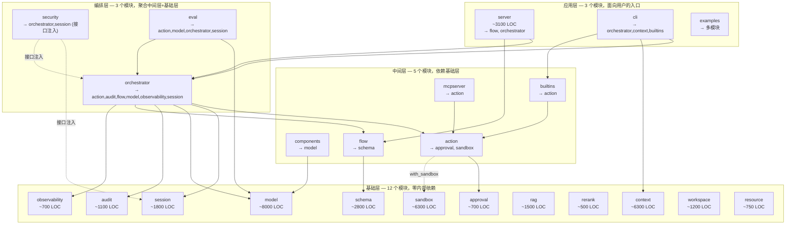
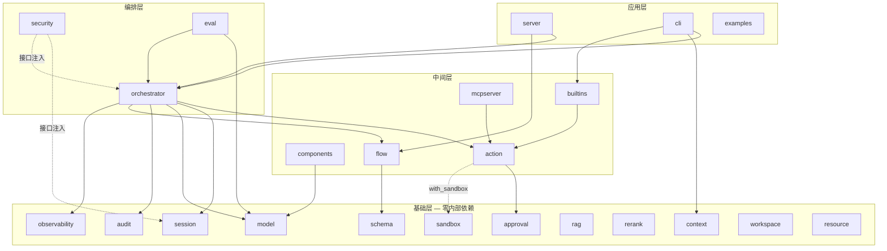

# Inferglow

Go 语言实现的 AI Agent 基础设施框架，对标 [Agently](https://github.com/AgentEra/Agently)（Python）的设计理念。

## 为什么

Go 生态缺乏一个对标 Agently 设计理念的框架：**契约优先、可单测编排、内置沙箱、明确的 Pause/Resume/Persist 能力**。Inferglow 提供一套可组合的基础设施模块，为上层 AI Agent 框架（inferglow）提供支撑。

## 架构概览

InferGlow 采用 **23 个独立 Go module** 的细粒度架构，按依赖深度自然形成四层结构。



## 可插拔架构 (Pluggable Architecture)

Inferglow 自 v2 起将沙箱执行与安全特性改造为**可选依赖**，让核心编排层默认保持最小体积、零安全开销，需要时再通过编译标签或接口注入按需启用。

### 1. Build Tags 机制（沙箱可选）

`action/executor_sandbox.go` 通过 `//go:build with_sandbox` 标签隔离，配套的 `action/executor_sandbox_stub.go` 在 `!with_sandbox` 下提供占位实现（调用 `Execute` 时返回明确错误）。默认编译不会引入 `github.com/inferglow/sandbox` 依赖。

```bash
# 默认模式（推荐）：不打包沙箱，体积更小
go build ./...

# 沙箱模式：打包完整沙箱后端
go build -tags with_sandbox ./...
```

### 2. 接口注入模式（安全可选）

`session` 与 `orchestrator/agent` 不再直接 import `security`，只保留接口契约：

| 接口 | 定义位置 | 实现位置 | 注入入口 |
|------|---------|---------|---------|
| `session.MessageHook` | `session/security_hook.go` | `security/sessionhook.SecurityHook` | `session.WithSecurityHook(hook)` |
| `agent.OutputSecurityHook` | `orchestrator/agent/security_hook.go` | `security/agenthook.OutputInjectionHook` | `agent.WithOutputSecurityHook(hook)` |
| `agent.PIIMasker` | `orchestrator/agent/agent.go` | `security/agenthook.PIIMasker`（适配 `pii.Masker`） | `agent.WithPIIMasker(m)` |

依赖方向严格单向：`security/sessionhook → session`，`security/agenthook → orchestrator/agent`。不注入即零开销。

### 3. 编译配置决策树

```
是否需要沙箱执行？
├── 是 → go build -tags with_sandbox ./...
└── 否 → go build ./...（默认，体积更小）

是否需要安全特性（PII/注入检测）？
├── 是 → 在 orchestrator 层注入 sessionhook/agenthook
└── 否 → 不注入，零开销
```

### 4. 快速开始

#### 默认模式（无沙箱、无安全钩子）

```go
ag := agent.New(sess, actExt, llm,
    agent.WithMaxRounds(10),
)
resp, err := ag.Run(ctx, "Hello", nil)
```

#### 启用安全特性（接口注入，无需特殊编译）

```go
import (
    "github.com/inferglow/security/sessionhook"
    "github.com/inferglow/security/agenthook"
    "github.com/inferglow/security/pii"
    promptinjection "github.com/inferglow/security/prompt_injection"
)

// 输入侧：注入检测钩子注入到 Session
secHook := sessionhook.NewSecurityHook(promptinjection.NewDefaultConfig())
sess := session.NewSessionWithOptions("id", 4000, session.WithSecurityHook(secHook))

// 输出侧：注入检测钩子注入到 Agent
outHook := agenthook.NewOutputInjectionHook(promptinjection.NewDefaultConfig())

// PII 脱敏：通过适配器把 *pii.Masker 包装成 agent.PIIMasker
piiMasker := agenthook.NewPIIMasker(pii.NewMasker(pii.MaskConfig{}))

ag := agent.New(sess, actExt, llm,
    agent.WithOutputSecurityHook(outHook),
    agent.WithPIIMasker(piiMasker),
)
```

#### 启用沙箱执行（需 `with_sandbox` 标签）

```bash
go build -tags with_sandbox ./...
```

```go
import (
    "github.com/inferglow/action"
    "github.com/inferglow/sandbox"
)

mgr := sandbox.NewManager()
_ = mgr.Register(sandbox.NewTrustedLocalProvider())
exec := action.NewSandboxExecutor(action.SandboxExecutorConfig{
    Manager:     mgr,
    DefaultMode: sandbox.ModeTrustedLocal,
})
// exec 实现 action.ActionExecutor，可注册为 Action
```

> 完整可运行示例见 [`examples/example_pluggable.go`](./examples/example_pluggable.go) 与 [`examples/example_sandbox_enabled.go`](./examples/example_sandbox_enabled.go)。

## 模块列表

23 个独立 Go module，按依赖深度分为四层。总代码量约 62,000 行（不含测试）。

### 基础层 — 12 个模块，零内部依赖

#### model — LLM Provider 统一抽象层 (~8000 LOC)

提供统一的 LLM Provider 抽象，屏蔽不同模型供应商（OpenAI、Anthropic、Ollama 等）的 API 差异。

- **模块路径**: `github.com/inferglow/model`
- **依赖**: 无（仅 stdlib + yaml.v3）
- **核心类型**: `ModelRequest`, `ModelResponse`, `StreamChunk`, `ModelRequester`, `StreamRequester`
- **Provider 实现**: OpenAICompatible, AnthropicCompatible, Ollama, OpenAIResponses（`/responses` 端点）
- **Schema 校验**: `BuildJSONSchemaFromOutput`（L1/L2）、`OutputValidator`（L4 后置校验 + 重试）
- **URL 解析**: `ResolveURL` — `full_url` 完全覆盖 `base_url + default_path`
- **非标字段映射**: `ContentMapping` + `ExtractByPath` — 从非标准 SSE 路径提取 delta/reasoning
- **流式归一化**: `LeadingThinkNormalizer` — 三态状态机分离 `<think>` 推理内容
- **缓存预算**: `UsageInfo.PromptTokensDetails["cached_tokens"]` — Prefix Cache 命中信息回传

#### schema — Contract-First Schema 引擎 (~2800 LOC)

通过 Go 泛型 + 反射实现编译期 + 运行时双重校验，约束 LLM 输出格式。

- **模块路径**: `github.com/inferglow/schema`
- **依赖**: 无（仅 yaml.v3）
- **核心类型**: `OutputSchema`, `FieldDef`, `DataType`, `ContractEngine`
- **核心功能**: 泛型推导、JSON Schema 转换、路径校验、JSON 提取

#### session — 对话记忆管理 (~1800 LOC)

对话历史维护、上下文窗口自动裁剪、多模态内容支持、JSON/YAML 持久化。

- **模块路径**: `github.com/inferglow/session`
- **依赖**: 无（安全特性通过 `MessageHook` 接口注入）
- **核心类型**: `Session`, `ChatMessage`, `ContentBlock`, `ResizeHandler`, `MessageHook`

#### sandbox — 沙箱执行框架 (~6300 LOC)

隔离的代码执行环境，支持多种沙箱后端。

- **模块路径**: `github.com/inferglow/sandbox`
- **依赖**: 无（完全独立）
- **核心类型**: `Provider`, `Handle`, `ExecutionPolicy`
- **后端实现**: Docker、gVisor、本地、TrustedLocal、Seatbelt、E2B、Windows RestrictedToken、Windows AppContainer、Windows Sandbox (WSB)

#### context — 上下文管理引擎 (~6300 LOC)

从 `session/contextmgr` 拆出的独立模块。三区压缩（hot/warm/cold）、Prefix Cache 预算、甜点区自适应、宪法区（Zone 0.5）、任务相关性重组。

- **模块路径**: `github.com/inferglow/context`
- **依赖**: 无（完全独立，通过接口与 session 交互）
- **核心类型**: `HybridManager`, `CacheBudgetUpdater`, `ConstitutionalZone`
- **核心功能**: sweet-spot 自适应阈值、缓存预算钩子（`CacheBudgetUpdater` 最小接口避免循环依赖）、三问重组、衰减预热

#### audit — 链表式审计链 (~1100 LOC)

基于 SHA-256 哈希指针的不可篡改审计日志，支持 HMAC 签名验证。

- **模块路径**: `github.com/inferglow/audit`
- **依赖**: 无
- **核心类型**: `AuditChain`, `AuditEntry`, `AuditHook`

#### approval — HITL 审批 (~700 LOC)

Human-in-the-Loop 审批流程管理。

- **模块路径**: `github.com/inferglow/approval`
- **依赖**: 无
- **核心类型**: `Manager`, `ApprovalRequest`, `AccessPolicy`

#### rag — RAG 管道 (~1500 LOC)

文档加载、文本分割、Embedding 注册、检索管道。

- **模块路径**: `github.com/inferglow/rag`
- **依赖**: 无
- **核心类型**: `Pipeline`, `Loader`（6 种格式）、`Splitter`（3 种策略）、`EmbeddingRegistry`

#### rerank — 重排序 (~500 LOC)

检索结果重排序，支持多种后端。

- **模块路径**: `github.com/inferglow/rerank`
- **依赖**: 无
- **核心类型**: `Reranker`, `Document`
- **后端**: Cohere、LLM-based、Fallback

#### observability — OpenTelemetry 集成 (~700 LOC)

语义化 Span 追踪，6 种 SpanKind 覆盖 Agent/LLM/Tool/Flow 全链路。

- **模块路径**: `github.com/inferglow/observability`
- **依赖**: 无

#### workspace — 工作区文件操作 (~1200 LOC)

沙箱化的文件/目录操作，路径穿越防护、文件大小/数量限制。

- **模块路径**: `github.com/inferglow/workspace`
- **依赖**: 无
- **核心功能**: SafePath 三重防护、ReadOnly 模式、LineageStore 血缘追踪

#### resource — 资源管理 (~750 LOC)

资源提供者抽象与管理。

- **模块路径**: `github.com/inferglow/resource`
- **依赖**: 无
- **核心类型**: `Provider`, `Manager`, `Handle`

### 中间层 — 5 个模块，依赖基础层

#### flow — TriggerFlow + LCEL 编排引擎 (~7400 LOC)

三层流引擎：线性 Flow（简单管道）、TriggerFlow 事件驱动引擎（复杂业务编排）、LCEL Chain（轻量线性管道）。

- **模块路径**: `github.com/inferglow/flow`
- **依赖**: `schema`
- **核心类型**: `Flow`, `Step`, `Operator`, `SignalNet`, `LifecycleMachine`, `Chain`
- **算子类型**: 13 种（chunk、signal_gate、batch_fanout、for_each、match_case 等）
- **LCEL Chain**: `LCEL().Pipe().Build()` 线性管道 + MapChain/BranchChain/ParallelChain 组合器
- **Step.Schema 校验**: 每步执行后 `validateStepOutput` 主动校验

#### action — Action Runtime (~2900 LOC)

将 Go 函数注册为可发现、可校验、可执行的动作单元。

- **模块路径**: `github.com/inferglow/action`
- **依赖**: `approval`, `sandbox`（`sandbox` 通过 `with_sandbox` build tag 可选）
- **核心类型**: `Action`, `ActionExecutor`, `ActionResult`, `ActionRegistry`
- **核心功能**: LocalFunctionExecutor（三种签名自动包装）、SandboxExecutor（需 `with_sandbox`）、ActionSpec 安全规格

#### components — Prompt/Tool 通用接口 (~400 LOC)

- **模块路径**: `github.com/inferglow/components`
- **依赖**: `model`

#### mcpserver — MCP 协议服务 (~850 LOC)

MCP JSON-RPC 2.0 服务端，三种传输全覆盖。

- **模块路径**: `github.com/inferglow/mcpserver`
- **依赖**: `action`
- **核心类型**: `Server`, `Transport`, `JSONRPCRequest`
- **传输**: stdio（标准输入输出）、SSE（GET `/sse` + POST `/messages`）、StreamableHTTP（POST `/mcp`）

#### builtins — 内置 Action/Policy/Tool (~2200 LOC)

预置的常用 Action、安全策略和 Tool 定义。

- **模块路径**: `github.com/inferglow/builtins`
- **依赖**: `action`

### 编排层 — 3 个模块，聚合中间层+基础层

#### orchestrator — Agent 编排层 / 用户入口 (~7700 LOC)

PLAN-EXECUTE 循环引擎。安全特性通过接口注入 / build tag 可选启用。

- **模块路径**: `github.com/inferglow/orchestrator`
- **依赖**: `action`, `audit`, `flow`, `model`, `observability`, `session`（`security` 接口注入；`sandbox` 通过 `with_sandbox` 可选）
- **核心类型**: `Agent`, `Engine`, `ActionDispatcher`, `LoopGuard`, `TurnLoop`, `CancelManager`
- **核心功能**: 并发 Action 执行、function calling、LLM 输出修复管道、死循环检测、三种取消安全点、Agent 回放测试

#### security — 安全基础设施 (~2000 LOC)

PII 脱敏、Prompt 注入检测、令牌桶限流、RBAC 访问控制。通过接口注入模式接入，不注入即零开销。

- **模块路径**: `github.com/inferglow/security`
- **依赖**: `session`、`orchestrator`（仅 `sessionhook`/`agenthook` 子包实现接口契约）
- **子模块**: `pii`（5 种模式）、`prompt_injection`（三级严重度）、`ratelimit`（令牌桶）、`rbac`、`sessionhook`（`MessageHook`）、`agenthook`（`OutputSecurityHook` / `PIIMasker`）

#### eval — 离线评估框架 (~750 LOC)

基于预录响应的 Agent 回放测试框架，支持并行执行与断言校验。

- **模块路径**: `github.com/inferglow/eval`
- **依赖**: `model`, `session`, `action`, `orchestrator`
- **核心类型**: `Suite`, `Case`, `Runner`, `ScriptedProvider`, `Report`
- **核心功能**: ScriptedProvider mock（实现 `model.ModelRequester`）、并行 Case 执行、Contains/NotContains/ToolSequence 断言、Golden Session 适配、Text/JSON 报告

#### examples — 示例代码 (~2800 LOC)

完整可运行的示例程序，覆盖主要使用场景。

- **模块路径**: `github.com/inferglow/examples`
- **依赖**: 多模块

### 应用层 — 3 个模块，面向用户的入口

#### server — REST API 服务 (~3100 LOC)

Agent HTTP 托管服务，提供 RESTful 接口、外部触发器、持久化 Memory、流式工具调用和运行时状态检查。

- **模块路径**: `github.com/inferglow/server`
- **依赖**: `orchestrator`（Agent 执行）, `flow`（声明式 Flow 数据模型 + trigger 子包）
- **核心类型**: `Server`, `Router`, `RunManager`, `MemoryStore`, `trigger.Registry`
- **子包**: `trigger/`（Webhook/Cron/EventBus 三种触发器）
- **架构说明**: server 对 flow 的依赖是**数据模型层**（REST API 需要序列化 `FlowDef`、注册 `stage.Registry`），Agent 执行路径通过 orchestrator 完成
- **V7 新增能力**:
  - 外部触发器：Webhook（HMAC 验签）、Cron（定时）、EventBus（事件驱动）
  - LCEL 声明式链（`flow/lcel.go`）：Chain/Pipe/Invoke/Build + 3 组合器
  - 持久化 Memory：MemoryStore 接口 + InMemoryStore + CRUD API
  - 运行时状态检查：只读 state/steps 查询 API
  - 流式工具调用：AgentCallbacks → SSE 事件流桥接
  - Session 结束自动提升：SessionEndHook 异步调用 LongMemPromoter

#### cli — 终端 REPL 客户端 (~1200 LOC)

交互式终端 Agent 客户端，内置持久记忆注入、上下文压缩、会话管理。GUI 项目可选择将 cli 作为子进程调用，或完全独立实现。

- **模块路径**: `github.com/inferglow/cli`
- **依赖**: `orchestrator`, `action`, `builtins`, `context`, `model`, `session`
- **核心类型**: `RunREPL`, `MemoryBridge`, `CLIConfig`, `CommandFunc`
- **核心功能**: 交互式 REPL、持久记忆注入（ProactiveRecall）、上下文压缩（`/compact`）、宪法区加载、会话恢复

## 模块依赖关系



| 模块 | 内部依赖 | 被谁依赖 |
|------|---------|----------|
| model | 无 | orchestrator, eval, components |
| schema | 无 | flow |
| flow | schema | orchestrator, server |
| action | approval, sandbox | orchestrator, mcpserver, builtins, eval |
| session | 无 | orchestrator, security, eval |
| audit | 无 | orchestrator |
| sandbox | 无 | action (build tag) |
| context | 无 | — (用户代码直接集成) |
| orchestrator | action, audit, flow, model, observability, session | security, eval, server |
| security | session, orchestrator (接口注入) | 用户代码 |
| eval | model, session, action, orchestrator | 用户代码 |
| server | flow（数据模型）, orchestrator（Agent 执行）, trigger（子包） | 用户代码 |
| cli | orchestrator, action, builtins, context, model, session | 用户代码 / GUI 子进程 |
| mcpserver | action | 用户代码 |
| builtins | action | 用户代码 |
| approval | 无 | action |
| rag | 无 | 用户代码 |
| rerank | 无 | 用户代码 |
| observability | 无 | orchestrator |
| workspace | 无 | 用户代码 |
| resource | 无 | 用户代码 |
| components | model | 用户代码 |

## 设计原则

1. **契约优先**: Schema 定义先行，LLM 输出受 L1-L4 四层校验约束（见下文"Schema 四层校验架构"）
2. **可单测编排**: 每个 Flow Step 是纯 Go 函数，可独立单元测试
3. **模块化**: 各子模块完全独立（action、session、sandbox 无依赖），可单独复用
4. **可扩展**: Provider/Executor/ResizeHandler 均通过接口扩展
5. **Go 适配**: 适配 Go 语言特性（goroutine 替代 async、泛型 + 反射替代 Pydantic）

## Schema 四层校验架构

Inferglow 实现 L1-L4 四层 schema 保障，确保 LLM 输出结构合规：

| 层级 | 机制 | 触发条件 | 合规率 |
|------|------|---------|--------|
| **L1 硬约束** | `response_format: json_schema`（XGrammar token 级约束） | `force_json:true` + `Output.Properties` 非空 | ~100% |
| **L2 API 约束** | 同 L1，云端 provider 服务端 structured output | 同上（OpenAI/DeepSeek） | ~99% |
| **L3 兜底 prompt** | system prompt 注入 schema 描述 | provider 不支持 json_schema 时降级 | ~80% |
| **L4 后置校验** | JSON 结构校验 + 字段类型检查 + 重试 | `WithOutputSchema` 配置后始终启用 | 检测层 |

- L1/L2 是**同一个 HTTP 参数**（`response_format`），区别在服务端实现（vLLM XGrammar vs 云端软约束）
- L3 是**降级方案**，仅当 L1/L2 不可用时注入 prompt
- L4 是**检测层**，即使 L1 生效也应跑 L4（防御性编程）
- Flow 的 `Step.Schema` 在每步执行后独立校验（`validateStepOutput`），与 L4 互补

## 与 Python Agently 的对照

| Python Agently | Go Inferglow | 职责 |
|---------------|-------------|------|
| `agently/core/model/` | `github.com/inferglow/model` | LLM Provider 抽象 |
| `agently/types/data/` + `types/plugins/` | `github.com/inferglow/schema` | Schema 定义 + 契约验证 |
| `agently/builtins/blocks/` + `trigger_flow/` | `github.com/inferglow/flow` | 编排引擎 |
| `agently/core/operation/Action/` | `github.com/inferglow/action` | Action 注册与执行 |
| `agently/core/session/` | `github.com/inferglow/session` | 对话记忆 |
| `agently/types/data/policy_approval.go` | `github.com/inferglow/sandbox` | 沙箱执行 |

## Go 语言适配

| Python 特性 | Go 适配方案 |
|------------|------------|
| ContextVar | context.Context + 值传递 |
| Pydantic TypeAdapter | Go 泛型 + 反射 + JSON Schema |
| 装饰器 (@agent.tool_func) | Go func + 显式调用 |
| async/await | goroutine + channel |
| TypedDict | Go struct |
| Protocol (typing) | Go interface |
| asyncio.Event/Lock | Go channel + sync.Mutex |

## 系统分析文档

详细的系统分析文档位于 [`docs/system-analysis/`](./docs/system-analysis/) 目录：

| 文档 | 内容 |
|------|------|
| [01-architecture-overview.md](./docs/system-analysis/01-architecture-overview.md) | 分层架构、模块依赖、全景调用关系图 |
| [02-model-and-schema.md](./docs/system-analysis/02-model-and-schema.md) | LLM Provider 抽象、Schema 引擎、ContractEngine |
| [03-flow.md](./docs/system-analysis/03-flow.md) | Flow/TriggerFlow 双引擎、13 种算子、Pause/Resume |
| [04-action-and-mcp.md](./docs/system-analysis/04-action-and-mcp.md) | Action Runtime、三种 Executor、MCP JSON-RPC 协议 |
| [05-session-sandbox-audit.md](./docs/system-analysis/05-session-sandbox-audit.md) | 双列表 Session、8 种沙箱后端、SHA-256 哈希链 |
| [06-security-observability-workspace.md](./docs/system-analysis/06-security-observability-workspace.md) | PII/注入/限流/RBAC、OTel 6 种 Span、工作区血缘 |
| [07-orchestrator.md](./docs/system-analysis/07-orchestrator.md) | Agent 入口、executeLoop 18 步逐行解析、LoopGuard |
| [08-call-chains.md](./docs/system-analysis/08-call-chains.md) | 13 条端到端调用链 + 全景关系图 + 错误传播表 |

## 开发状态

所有模块均已实现并经过完整测试：

- **23 个 Go module**：全部通过 `go build` 和 `go vet`，Windows 交叉编译 clean
- **orchestrator 编排层**：Agent Loop + function calling + 并发 Action + 死循环检测 + 三种取消安全点
- **Schema 四层校验**：L1 json_schema / L2 API 约束 / L3 prompt 兜底 / L4 后置校验+重试 + Flow step.Schema
- **MCP 协议**：JSON-RPC 2.0 三种传输全覆盖（stdio / SSE / StreamableHTTP）
- **沙箱**：8 种后端（Docker、gVisor、本地、TrustedLocal、Seatbelt、E2B、Windows RestrictedToken/AppContainer/Sandbox）
- **上下文管理**：独立 `context/` 模块，三区压缩 + Prefix Cache 预算 + 甜点区自适应 + 宪法区
- **评估框架**：`eval/` 离线回放测试，ScriptedProvider mock + 并行执行 + 断言校验
- **外部触发器**：Webhook（HMAC 验签）/ Cron（定时）/ EventBus（事件驱动），trigger.Registry 生命周期管理
- **LCEL 声明式链**：Chain/Pipe/Invoke/Build + MapChain/BranchChain/ParallelChain 组合器
- **持久化 Memory**：MemoryStore 接口 + InMemoryStore + CRUD API + SessionEndHook 自动提升
- **运行时状态检查**：只读 state/steps 查询 API，ExecState 快照
- **流式工具调用**：AgentCallbacks → SSE 事件流桥接，step_done 逐步事件
- **CLI 终端客户端**：`cli/` 独立模块，交互式 REPL + 持久记忆注入 + 上下文压缩 + 会话恢复，GUI 可作子进程接入

### V6 架构演进完成事项

| 梯队 | 任务 | 状态 | 说明 |
|------|------|:----:|------|
| **第一梯队** 结构修复 | S1 otel 解耦 | ✅ | `ports.go` SpanStarter 接口，删除 7 处直接 import |
| | S2 contextmgr 独立 module | ✅ | `context/` 从 `session/` 拆出，独立 go.mod |
| | S3 middleware.Handler 统一签名 | ✅ | `orchestrator/middleware/` 统一 `Handler` 类型 |
| **第二梯队** fork 差异化 | S4 team/ 包 | ✅ | Multi-Agent 协调器 |
| | S5 扩展机制文档化 | ✅ | `docs/EXTENDING.md` 7 种机制 |
| | F1 HITL 审批集成 | ✅ | `approval/` 独立模块 |
| | F3 Agent 回放测试 | ✅ | `agent/replay.go` |
| | F4 提示词版本标记 | ✅ | `SessionData.PromptVersion` |
| | F5 成本模型 | ✅ | `CacheBudgetUpdater` 接口 |
| **第三梯队** 远期 | L1 Prefix Cache 预算 | ✅ | `context/hybrid.go` sweet-spot + 缓存预算钩 |
| | L2 Eval Runner | ✅ | `eval/` 独立模块，11 个测试 |
| | L3 MCP 三传输 | ✅ | stdio + SSE + StreamableHTTP |
| | L4 Windows 沙箱 | ✅ | RestrictedToken + AppContainer + WindowsSandbox (WSB) |

## License

MIT
