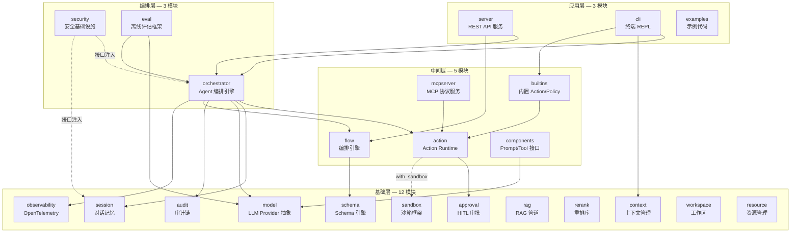

# 01 · 项目概述与设计哲学

## 一、项目定位

- **Inferglow** 是一个 **Go 语言实现的 AI Agent 基础设施框架**
- 对标 Python [Agently](https://github.com/AgentEra/Agently) 的设计理念，提供一套可组合的模块化基础设施，为上层 AI Agent 应用提供支撑
- **核心差异：** 与 Python 生态的 Agently 相比，Inferglow 利用 Go 的**静态类型系统**、**goroutine 并发模型**和**编译期校验**，提供了更严格的契约保障和更优的运行性能

## 二、设计哲学

| 原则 | 说明 | 代码体现 |
|------|------|---------|
| **契约优先** | Schema 定义先行，LLM 输出受四层校验约束 | `schema.OutputSchema` → L1–L4 校验链 |
| **可单测编排** | 每个 Flow Step 是纯 Go 函数，可独立单元测试 | `flow.StepFunc` 签名 `func(context.Context, any) (any, error)` |
| **模块化** | 23 个独立 Go module，零循环依赖 | Graphify 检测确认无 import cycle |
| **可扩展** | Provider / Executor / ResizeHandler 均通过接口扩展 | `model.ModelRequester`、`action.ActionExecutor` |
| **Go 适配** | goroutine 替代 async、泛型+反射替代 Pydantic | `goroutine + channel` 替代 `async/await` |
| **可选安全** | 沙箱和安全特性通过 build tag / 接口注入可选启用 | `//go:build with_sandbox` |

## 三、整体架构图

## 四、Go 语言适配策略对照

| Python 特性 | Go 适配方案 |
|------------|------------|
| ContextVar | `context.Context` + 值传递 |
| Pydantic TypeAdapter | Go 泛型 + 反射 + JSON Schema |
| 装饰器 (`@agent.tool_func`) | Go func + 显式注册 |
| async/await | goroutine + channel |
| TypedDict | Go struct |
| Protocol (typing) | Go interface |
| asyncio.Event / Lock | Go channel + sync.Mutex |

## 五、与 Python Agently 的对比

| 维度 | Agently (Python) | Inferglow (Go) |
|------|-----------------|----------------|
| **类型系统** | 动态 | 静态 |
| **并发模型** | asyncio | goroutine |
| **序列化** | Pydantic | Go struct + JSON |
| **模块化** | Python package | Go module |
| **编译** | 解释执行 | 编译 |
| **部署** | `pip install` | `go build` |