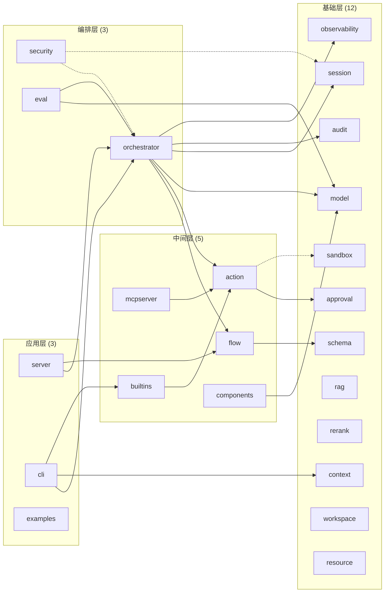

# 02 · 模块架构总览

## 一、四层架构总览

| 层级 | 模块数 | 总 LOC | 依赖方向 | 职责 |
|------|--------|--------|---------|------|
| **基础层** | 12 | ~25,000 | 零内部依赖 | 基础设施零件 |
| **中间层** | 5 | ~13,000 | 依赖基础层 | 组合基础设施 |
| **编排层** | 3 | ~11,000 | 聚合中间层+基础层 | 编排与安全 |
| **应用层** | 3 | ~7,000 | 依赖编排层 | 用户入口 |

## 二、完整模块依赖图

## 三、模块清单（按层）

### 基础层 (12)

| 模块 | 路径 | 代码量 | 核心依赖 | 核心职责 |
|------|------|--------|---------|---------|
| model | `github.com/inferglow/model` | ~8,000 | 无 | LLM Provider 统一抽象 |
| schema | `github.com/inferglow/schema` | ~2,800 | 无 | Contract-First Schema 引擎 |
| session | `github.com/inferglow/session` | ~1,800 | 无 | 对话记忆管理 |
| sandbox | `github.com/inferglow/sandbox` | ~6,300 | 无 | 沙箱执行框架 |
| context | `github.com/inferglow/context` | ~6,300 | 无 | 上下文管理引擎 |
| audit | `github.com/inferglow/audit` | ~1,100 | 无 | 链表式审计链 |
| approval | `github.com/inferglow/approval` | ~700 | 无 | HITL 审批 |
| rag | `github.com/inferglow/rag` | ~1,500 | 无 | RAG 管道 |
| rerank | `github.com/inferglow/rerank` | ~500 | 无 | 重排序 |
| observability | `github.com/inferglow/observability` | ~700 | 无 | OpenTelemetry 集成 |
| workspace | `github.com/inferglow/workspace` | ~1,200 | 无 | 工作区 |
| resource | `github.com/inferglow/resource` | ~750 | 无 | 资源管理 |

### 中间层 (5)

| 模块 | 路径 | 代码量 | 核心依赖 | 核心职责 |
|------|------|--------|---------|---------|
| flow | `github.com/inferglow/flow` | ~7,400 | schema | 编排引擎 |
| action | `github.com/inferglow/action` | ~2,900 | approval, sandbox（可选） | Action Runtime |
| components | `github.com/inferglow/components` | ~400 | model | Prompt/Tool 接口 |
| mcpserver | `github.com/inferglow/mcpserver` | ~850 | action | MCP 协议服务 |
| builtins | `github.com/inferglow/builtins` | ~2,200 | action | 内置 Action/Policy |

### 编排层 (3)

| 模块 | 路径 | 代码量 | 核心依赖 | 核心职责 |
|------|------|--------|---------|---------|
| orchestrator | `github.com/inferglow/orchestrator` | ~7,700 | action, audit, flow, model, observability, session | Agent 编排引擎 |
| security | `github.com/inferglow/security` | ~2,000 | session（接口注入）, orchestrator（接口注入） | 安全基础设施 |
| eval | `github.com/inferglow/eval` | ~750 | model, session, action, orchestrator | 离线评估框架 |

### 应用层 (3)

| 模块 | 路径 | 代码量 | 核心依赖 | 核心职责 |
|------|------|--------|---------|---------|
| server | `github.com/inferglow/server` | ~3,100 | flow, orchestrator | REST API 服务 |
| cli | `github.com/inferglow/cli` | ~1,200 | orchestrator, action, builtins, context | 终端 REPL |
| examples | `github.com/inferglow/examples` | ~2,800 | 多模块 | 示例代码 |

## 四、依赖规则

1. **严格单向依赖**：基础层 → 中间层 → 编排层 → 应用层，不允许反向依赖。
2. **同一层内模块不互相依赖**：每个模块保持独立，基础层 12 个模块均无内部依赖。
3. **横切关注点通过接口注入**：`orchestrator` 不反向依赖 `security`，而是通过 `OutputSecurityHook` / `PIIMasker` 接口注入实现安全特性。
4. **Build Tag 隔离可选依赖**：`action` 通过 `//go:build with_sandbox` 编译标签可选依赖 `sandbox`，默认编译不包含沙箱，体积更小。

## 五、Graphify 验证的依赖健康度

Graphify 知识图谱分析确认：

- **无循环依赖**（Import Cycles: None detected）
- **8017 个节点**覆盖全部代码实体
- **17577 条边**反映真实依赖关系
- **80% EXTRACTED + 20% INFERRED** 边类型分布
- **414 个社区**对应模块级聚合