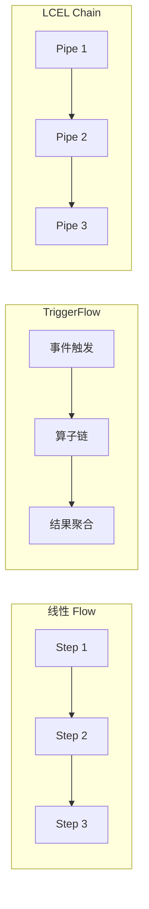
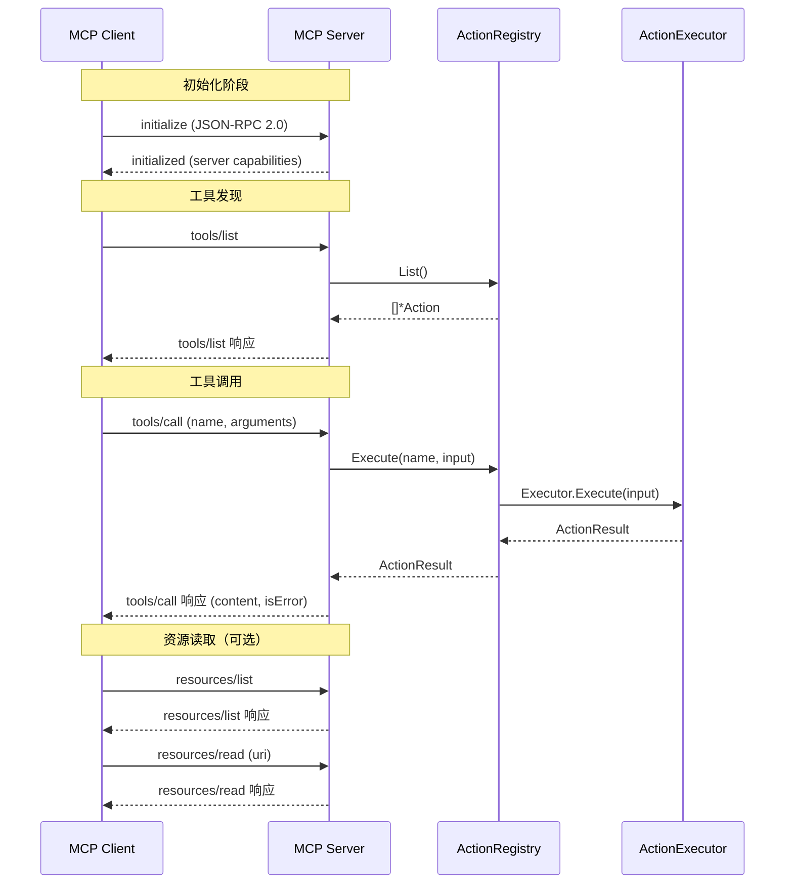

# 04 · 中间层详解

中间层由 5 个独立 Go module 组成，总代码量约 13,000 LOC，它们组合基础层的基础设施零件，提供可复用的编排、执行、模板和协议能力。编排层和应用层在此之上构建具体业务逻辑。

---

## 一、flow — 编排引擎

**模块路径：** `github.com/inferglow/flow`

**依赖：** `schema`

**代码量：** ~7400 LOC

flow 是 Inferglow 最核心的中间层模块，定义了 Agent 任务的执行流程。它提供三种流式编排模型，支持从线性流水线到复杂事件驱动的工作流。

### 1.1 三层流引擎



| 流引擎 | 适用场景 | 特点 |
|--------|---------|------|
| **Linear Flow** | 固定顺序的任务管线 | Step 之间通过 Edge 显式连接，支持分支和条件跳转 |
| **TriggerFlow** | 事件驱动的异步流程 | 通过 SignalNet 实现事件触发，适合外部事件驱动的 Agent 流程 |
| **LCEL Chain** | 声明式函数式管道 | 链式 API `Pipe().Map().Branch().Parallel()`，适合快速原型 |

### 1.2 Flow 核心类型

```go
type Flow struct {
    steps     map[string]*Step
    edges     []Edge
    branches  []Branch
    startStep *Step
    // 持久化配置
    autoCheckpoint  bool
    checkpointStore CheckpointStore
    // ...
}

type Step struct {
    Name   string
    Func   StepFunc
    Schema *schema.OutputSchema  // 可选，为 nil 时不校验
    // ...
}

type StepFunc func(context.Context, any) (any, error)

type Edge struct {
    From string
    To   string
    // ...
}

type Branch struct {
    Condition func(context.Context, any) (bool, error)
    TrueTarget  string
    FalseTarget string
    // ...
}
```

`StepFunc` 是 Flow 中最基本的执行单元，其签名 `func(context.Context, any) (any, error)` 遵循 Go 标准实践——输入输出均为 `any` 类型，由具体算子通过类型断言实现类型安全。这种设计使得每个 Step 可独立单元测试，体现了"可单测编排"的设计哲学。

### 1.3 13 种算子类型

| 算子 | 用途 | 输入 | 输出 |
|------|------|------|------|
| `chunk` | 数据分块 | 任意数据 | `[]any` 分块结果 |
| `signal_gate` | 信号门控 | 信号事件 | 门控通过的信号 |
| `batch_fanout` | 批量扇出 | `[]any` 列表 | 每个元素独立下发 |
| `batch_collect` | 批量收集 | 多个并发结果 | 聚合后的 `[]any` |
| `for_each` | 循环执行 | 可迭代对象 | 每个元素执行结果 |
| `match_case` | 模式匹配 | 任意值 | 匹配分支的结果 |
| `collect_branch` | 分支收集 | 多个分支结果 | 合并后的结果 |
| `action` | Action 调用 | Action 参数 | Action 执行结果 |
| `llm_call` | LLM 调用 | Prompt 输入 | LLM 响应 |
| `sub_flow` | 子流程 | 子 Flow 输入 | 子 Flow 输出 |
| `intervention` | 人工干预 | 待审批请求 | 审批结果 |
| `passthrough` | 透传 | 任意值 | 原样输出 |
| `code_exec` | 代码执行 | 代码内容 | 执行结果 |

这 13 种算子覆盖了从数据变换、条件分支、并行扇出到外部调用和人工审核的完整编排场景。算子的组合使用构成了 Flow 的核心表达能力。

### 1.4 FlowContext 接口

FlowContext 是 flow 包定义的横切接口，包含 7 个核心横切方法和多个扩展方法。它通过 `context.Context` 值注入在整个 Flow 执行链路中传递，使得每个 Step 都可以访问基础设施能力而不需要直接依赖中层模块。

```go
type FlowContext interface {
    // 核心横切方法
    ExecuteAction(ctx context.Context, name string, params map[string]any) (any, error)
    GenerateModel(ctx context.Context, system string, userMessage string) (string, error)
    SessionHistory() []map[string]any
    AppendSession(role string, content any)
    AuditAppend(source, action string, input, output any)
    SetValue(key string, value any)
    GetValue(key string) (any, bool)

    // 扩展方法
    StartSpan(ctx context.Context, kind SpanKind, name string) (context.Context, Span)
    MaskInput(input string) string
    CheckOutput(output string) error
    RequestPause(reason string) error
    RunAgent(ctx context.Context, userMessage, systemPrompt string, opts *AgentRunOptions) (string, error)
    RunAgentParallel(ctx context.Context, agents []AgentSubTask) ([]string, error)
}
```

FlowContext 的横切方法已拆分为独立小接口，通过 context 值传递，未注入时自动降级为 noop 实现：

| 小接口 | Getter | 未注入时 |
|--------|--------|---------|
| `AuditHook` | `AuditHookFrom(ctx)` | noop |
| `SecurityHook` | `SecurityHookFrom(ctx)` | noop |
| `SpanStarterHook` | `SpanStarterHookFrom(ctx)` | noop |
| `KVStore` | `KVStoreFrom(ctx)` | noop |

### 1.5 LCEL 声明式链

LCEL（LangChain Expression Language）风格的声明式链提供函数式 API，适合快速构建简单流程：

```go
// 线性管道
chain := flow.LCEL().Pipe(step1).Pipe(step2).Pipe(step3).Build()

// Map 变换
chain := flow.LCEL().Map(func(v any) any { return v }).Build()

// 条件分支
chain := flow.LCEL().Branch(
    func(ctx context.Context, v any) (bool, error) {
        return v.(int) > 10, nil
    },
    trueBranch,  // 条件成立时执行
    falseBranch, // 条件不成立时执行
).Build()

// 并行执行
chain := flow.LCEL().Parallel(chain1, chain2).Build()
```

| LCEL 组合子 | 说明 | 类似概念 |
|-------------|------|---------|
| `Pipe` | 线性串联，前一输出为后一输入 | Unix pipe |
| `Map` | 对输入做变换 | `map` 函数 |
| `Branch` | 条件分支 | `if/else` |
| `Parallel` | 并行执行多个子链 | `goroutine + WaitGroup` |

### 1.6 Pause/Resume 机制

Flow 支持执行暂停和恢复，适用于人工审核（HITL）等需要中断等待的场景：

```go
// 持久化配置
type ExecutionPersistence struct {
    Serializer  Serializer
    Store       CheckpointStore
    // ...
}

// 文件系统检查点
type FileCheckpointStore struct {
    basePath string
    // ...
}

// 执行快照
type ExecutionSnapshot struct {
    FlowName    string
    State       map[string]any
    CurrentStep string
    Errors      []string
    // ...
}
```

暂停信号通过 context 值注入实现：

```go
// 注入暂停通道
ctx = flow.WithPauseSignal(ctx, pauseCh)

// 在 Step 中检查
ch, ok := flow.PauseSignalFrom(ctx)
if ok {
    select {
    case <-ch:
        // 暂停执行，保存快照
        return nil, flow.ErrPauseRequested
    default:
        // 继续执行
    }
}
```

### 1.7 Flow 构建和执行示例

```go
// 构建一个完整的 Flow
myFlow := flow.NewFlow("data-pipeline").
    AddStep("fetch", fetchStep).
    AddStep("transform", transformStep).
    AddStep("analyze", analyzeStep).
    AddEdge("fetch", "transform").
    AddEdge("transform", "analyze").
    WithCheckpoint(flow.FileCheckpointStore{BasePath: "./checkpoints"}).
    Build()

// 执行 Flow
result, err := myFlow.Execute(ctx, inputData)
if err != nil {
    // 处理错误
}
```

---

## 二、action — Action Runtime

**模块路径：** `github.com/inferglow/action`

**依赖：** `approval`（`sandbox` 通过 `with_sandbox` build tag 可选）

**代码量：** ~2900 LOC

action 模块定义了 Agent 可执行的各种"动作"的运行时抽象，包括注册、调度和执行。它是 Inferglow 中工具调用的核心基础设施。

### 2.1 核心类型

```go
// Action 定义
type Action struct {
    Name        string
    Description string
    Schema      map[string]any
    Executor    ActionExecutor
    Tags        []string
}

// 动作注册表
type ActionRegistry struct {
    actions map[string]*Action
    mu      sync.RWMutex
    // ...
}

// 执行结果
type ActionResult struct {
    OK       bool
    Status   string   // "success" | "error" | "blocked"
    Result   any
    Error    string
    // ...
}
```

`ActionRegistry` 使用读写锁保护并发访问，支持 `List()`、`Register()`、`Execute()` 等标准操作。`Action` 通过 `Schema` 字段描述其输入参数的 JSON Schema，供 LLM 生成对应的工具调用参数。

### 2.2 三种执行器

| 执行器 | 说明 | 编译标签 | 适用场景 |
|--------|------|---------|---------|
| `LocalFunctionExecutor` | 三种签名自动包装 | 默认 | 本地函数调用 |
| `MCPExecutor` | 远程 MCP 协议客户端 | 默认 | 外部 MCP 服务调用 |
| `SandboxExecutor` | 沙箱执行器 | `with_sandbox` | 沙箱隔离的代码执行 |

`SandboxExecutor` 通过 `//go:build with_sandbox` 编译标签隔离，在不启用沙箱时编译为 stub 实现，调用时返回错误。

### 2.3 三种函数签名自动包装

`LocalFunctionExecutor` 支持三种函数签名，通过反射自动适配，降低用户注册成本：

```go
// 签名 1: 标准签名（推荐）
// 支持 context.Context 传递、泛型输入输出、error 返回
func(ctx context.Context, input InputT) (OutputT, error)

// 签名 2: 简化签名
// 不需要 context 的场景
func(input InputT) (OutputT, error)

// 签名 3: 仅输出签名
// 纯计算场景，无需 error 处理
func(ctx context.Context, input InputT) OutputT
```

自动包装通过反射实现，在注册时检测函数签名类型，生成对应的适配器。这种设计借鉴了 Go 标准库 `http.HandlerFunc` 的类型适配模式。

### 2.4 编译时安全检查

action 模块通过双文件机制实现可选的沙箱安全：

```go
// executor_sandbox.go — 完整实现
//go:build with_sandbox

package action

func NewSandboxExecutor(config SandboxExecutorConfig) *SandboxExecutor {
    // 完整实现：创建沙箱 Provider、配置 ExecutionPolicy、注册审批
    return &SandboxExecutor{
        sandboxProvider: config.Provider,
        approvalManager: config.ApprovalManager,
        policy:          config.Policy,
    }
}
```

```go
// executor_sandbox_stub.go — 占位实现
//go:build !with_sandbox

package action

func NewSandboxExecutor(config SandboxExecutorConfig) *SandboxExecutor {
    return &SandboxExecutor{} // 调用 Execute 返回错误
}
```

这种设计确保了：
- **零依赖**：不启用沙箱时，sandbox 模块不会被编译进来
- **编译期安全**：不恰当的调用在编译阶段即可发现
- **API 一致**：无论是否启用沙箱，调用方代码不变

---

## 三、components — Prompt/Tool 接口

**模块路径：** `github.com/inferglow/components`

**依赖：** `model`

**代码量：** ~400 LOC

components 是 Inferglow 中最小的模块，提供 Prompt 模板的接口抽象和三种内置实现。它定义了统一的 `ChatTemplate` 契约，使上层编排层可以无差别地使用不同模板策略。

### 3.1 ChatTemplate 接口

```go
// Prompt 模板接口
type ChatTemplate interface {
    Format(input map[string]any) ([]model.ChatMessage, error)
}
```

`Format` 方法接收一个键值对输入，返回 `model.ChatMessage` 列表，直接对接 `model` 模块的 `ModelRequest.Messages` 字段。这种设计使得 Prompt 模板的输出与 LLM 请求无缝衔接。

### 3.2 三种实现

| 实现 | 说明 | 典型用法 |
|------|------|---------|
| `FewShotTemplate` | Few-shot 示例模板 | 按示例格式注入多组 `input→output` 示例 |
| `SystemTemplate` | 系统提示模板（条件段） | 根据条件动态包含/排除系统提示中的段落 |
| `StringTemplate` | 字符串模板 | 简单的 `{{placeholder}}` 替换 |

**FewShotTemplate** 适用于需要给 LLM 提供示例的场景，例如：

```go
template := components.NewFewShotTemplate().
    AddExample("什么是 Go？", "Go 是一种静态类型编译型语言。").
    AddExample("什么是 goroutine？", "goroutine 是 Go 的轻量级线程。")

messages, err := template.Format(map[string]any{
    "input": "什么是 interface？",
})
```

**SystemTemplate** 支持条件段落，根据运行时上下文决定是否包含某段系统提示：

```go
template := components.NewSystemTemplate().
    AddSection("role", "你是一个 AI 助手。").
    AddConditionalSection("tools", "你可以使用以下工具：{{.tools}}", func(input map[string]any) bool {
        _, ok := input["tools"]
        return ok
    })
```

**StringTemplate** 是最简单的实现，支持 `{{.FieldName}}` 占位符替换，适用于不需要复杂逻辑的模板场景。

---

## 四、mcpserver — MCP 协议服务

**模块路径：** `github.com/inferglow/mcpserver`

**依赖：** `action`

**代码量：** ~850 LOC

mcpserver 将 Inferglow 的 Action 能力暴露为标准 MCP（Model Context Protocol）服务，使任何 MCP 客户端（包括其他 Agent 框架、IDE 插件等）都可以调用 Inferglow 的 Action。

### 4.1 三种传输协议

| 传输 | 协议 | 端点 | 适用场景 |
|------|------|------|---------|
| `StdioTransport` | 标准输入输出 | stdin/stdout | 本地进程通信（如 IDE 插件） |
| `SSETransport` | Server-Sent Events | GET `/sse` + POST `/messages` | 远程服务长期连接 |
| `StreamableHTTPTransport` | HTTP 流式 | POST `/mcp` | 短连接 HTTP 请求 |

`StdioTransport` 适用于嵌入场景，例如 VS Code 扩展通过子进程启动 MCP Server 进行通信。`SSETransport` 适用于需要实时推送的远程服务。`StreamableHTTPTransport` 则兼顾了 HTTP 的简单性和流式响应的实时性。

### 4.2 MCP 协议映射

MCP 基于 JSON-RPC 2.0 协议，mcpserver 将 MCP 协议方法映射到 `ActionRegistry` 的操作：



| MCP 方法 | ActionRegistry 映射 | 说明 |
|----------|-------------------|------|
| `tools/list` | `ActionRegistry.List()` | 返回所有注册的 Action 作为 MCP 工具 |
| `tools/call` | `ActionRegistry.Execute()` | 执行指定的 Action 并返回结果 |
| `resources/list` | 可选扩展 | 列出可用资源 |
| `resources/read` | 可选扩展 | 读取指定资源内容 |

### 4.3 服务端构建示例

```go
// 构建 MCP Server
registry := action.NewActionRegistry()
registry.Register("bash", bashAction)
registry.Register("fetch", fetchAction)

server := mcpserver.NewServer("my-agent", "1.0.0").
    WithRegistry(registry).
    WithTransport(mcpserver.StdioTransport{})
    // 或使用 SSETransport
    // WithTransport(mcpserver.SSETransport{Addr: ":8080"})

// 启动服务
server.Serve(ctx)
```

---

## 五、builtins — 内置 Action/Policy

**模块路径：** `github.com/inferglow/builtins`

**依赖：** `action`

**代码量：** ~2200 LOC

builtins 模块提供了开箱即用的内置 Action 集合，覆盖 Agent 最常用的文件操作、网络请求、代码执行和记忆管理场景。这些 Action 通过 `ActionRegistry.Register()` 注入，用户可选择性加载。

### 5.1 内置 Action 清单

| 内置 Action | 工厂函数 | 说明 | 输入参数 |
|-------------|---------|------|---------|
| Bash 命令执行 | `NewBashExecutorAction` | 执行 Bash 命令并返回输出 | `command: string`, `timeout: int` |
| 代码执行 | `NewCodeExecutorAction` | 执行代码片段 | `language: string`, `code: string` |
| 算术计算 | `NewCalculatorAction` | 安全算术表达式求值 | `expression: string` |
| URL 抓取 | `NewURLFetchAction` | 获取 URL 内容 | `url: string`, `method: string` |
| 文件读取 | `NewFileReadAction` | 读取文件内容 | `path: string` |
| 文件写入 | `NewFileWriteAction` | 写入文件内容 | `path: string`, `content: string` |
| 网络搜索 | `NewWebSearchAction` | 搜索网络信息 | `query: string`, `count: int` |
| 记忆存储 | `NewMemoryRememberAction` | 存储记忆条目 | `key: string`, `value: string` |
| 记忆删除 | `NewMemoryForgetAction` | 删除记忆条目 | `key: string` |
| JSON 处理 | `NewJSONProcessorAction` | JSON 解析和转换 | `data: string`, `operation: string` |

### 5.2 典型 Action 实现模式

builtins 中的 Action 遵循统一的实现模式，以 `NewURLFetchAction` 为例：

```go
func NewURLFetchAction() *action.Action {
    return &action.Action{
        Name:        "url_fetch",
        Description: "获取指定 URL 的内容",
        Schema: map[string]any{
            "type": "object",
            "properties": map[string]any{
                "url": map[string]any{
                    "type":        "string",
                    "description": "目标 URL",
                },
                "method": map[string]any{
                    "type":    "string",
                    "enum":    []string{"GET", "POST"},
                    "default": "GET",
                },
            },
            "required": []string{"url"},
        },
        Executor: action.NewLocalFunctionExecutor(fetchURL),
        Tags:     []string{"network", "utility"},
    }
}

func fetchURL(ctx context.Context, input struct {
    URL    string `json:"url"`
    Method string `json:"method,omitempty"`
}) (*FetchResult, error) {
    // 实现 HTTP 请求逻辑
    // ...
}
```

### 5.3 选择性加载

用户可以根据需要选择性加载内置 Action，避免不必要的依赖：

```go
registry := action.NewActionRegistry()

// 选择性注册
registry.Register("bash", builtins.NewBashExecutorAction())
registry.Register("fetch", builtins.NewURLFetchAction())
registry.Register("calculator", builtins.NewCalculatorAction())
registry.Register("search", builtins.NewWebSearchAction())

// 注册全部
builtins.RegisterAll(registry)
```

---

## 中间层依赖关系总览

```
flow ──→ schema
action ──→ approval
action ──→ sandbox (可选，通过 with_sandbox build tag)
components ──→ model
mcpserver ──→ action
builtins ──→ action
```

中间层 5 个模块之间的依赖关系清晰：`flow` 依赖 `schema` 进行输出校验，`action` 依赖 `approval` 进行审批并可选择依赖 `sandbox` 进行安全执行，`mcpserver` 和 `builtins` 均依赖 `action` 注册和执行动作，`components` 依赖 `model` 构建 Prompt。所有依赖均为单向，无循环依赖，验证了架构的模块化设计目标。