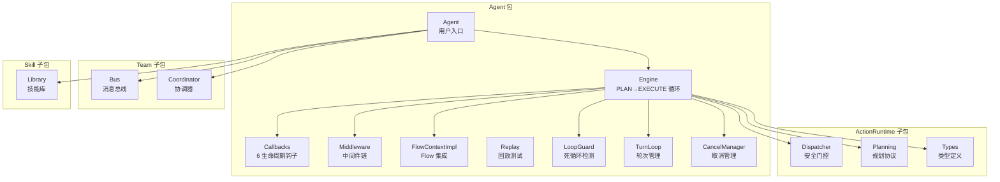
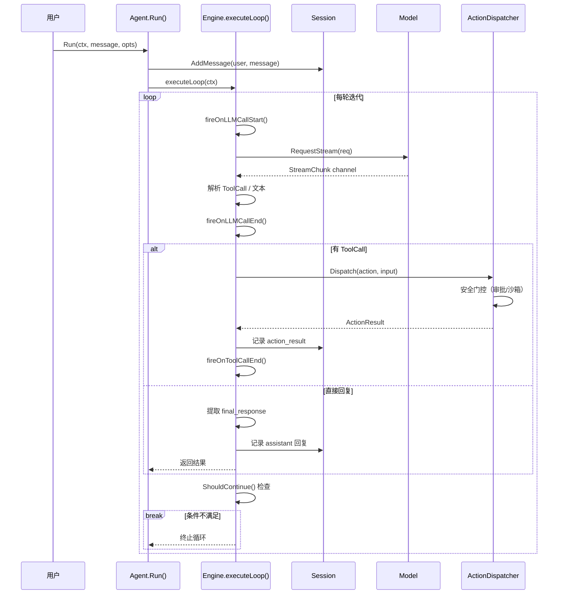
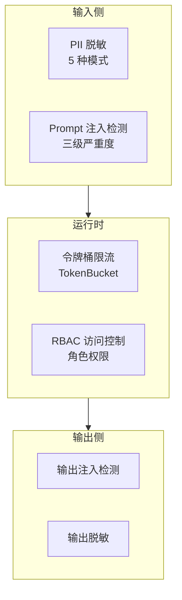

# 05 · 编排层详解

编排层是 Inferglow 架构的第三层，承担着聚合基础层与中间层能力、提供 Agent 运行时编排与安全管控的核心职责。该层包含三个模块：`orchestrator`（Agent 编排引擎）、`security`（安全基础设施）和 `eval`（离线评估框架），总计约 11,000 LOC。

---

## 一、orchestrator — Agent 编排引擎

**模块路径：** `github.com/inferglow/orchestrator`  
**依赖：** `action`、`audit`、`flow`、`model`、`observability`、`session`  
**代码量：** ~7700 LOC

### 1.1 子包结构

`orchestrator` 模块内部划分为四个子包：

| 子包 | 路径 | 职责 |
|------|------|------|
| `agent/` | `orchestrator/agent` | 核心：Agent 入口、Engine 循环、生命周期、中间件 |
| `actionruntime/` | `orchestrator/actionruntime` | 分发：Dispatcher、规划协议、类型定义 |
| `team/` | `orchestrator/team` | 多 Agent：消息总线、协调器 |
| `skill/` | `orchestrator/skill` | 技能库 |



### 1.2 Agent 核心结构

`Agent` 结构体是编排层的用户入口，封装了执行引擎、会话扩展、Action 扩展、安全钩子、中间件链等所有运行时依赖：

```go
type Agent struct {
    session      *SessionExtension
    actionExt    *ActionExtension
    engine       *Engine
    maxRounds    int
    systemPrompt string
    streamTimeout time.Duration
    outputHook   OutputSecurityHook
    piiMasker    PIIMasker
    features     Features
    callbacks    *AgentCallbacks
    middlewares  []Middleware
    // ...
}
```

### 1.3 配置选项

创建 Agent 时通过 Option 函数式配置模式设定参数：

| 选项 | 类型 | 默认值 | 说明 |
|------|------|--------|------|
| `WithMaxRounds` | int | 10 | 最大迭代轮数 |
| `WithSystemPrompt` | string | "" | 系统提示词 |
| `WithStreamTimeout` | duration | 5min | 流超时 |
| `WithOutputSecurityHook` | interface | nil | 输出安全钩子 |
| `WithPIIMasker` | interface | nil | PII 脱敏器 |
| `WithFeatures` | struct | 默认 | 功能开关 |
| `WithCallbacks` | struct | nil | 生命周期回调 |
| `WithMiddleware` | []Middleware | nil | 中间件链 |

### 1.4 executeLoop 执行流程

`executeLoop` 是 Agent 的核心循环，实现了 PLAN→EXECUTE 的完整迭代：



### 1.5 循环控制条件

每轮迭代结束后通过 `shouldContinue` 判断是否继续循环：

```go
func shouldContinue(decision Decision, roundIndex int, maxRounds int) bool {
    if maxRounds > 0 && roundIndex >= maxRounds {
        return false      // 达到最大轮数
    }
    if decision.NextAction != "execute" {
        return false      // LLM 决定直接回复
    }
    if !decision.UseAction {
        return false      // 不需要使用 action
    }
    return len(decision.ActionCalls) > 0  // 有可执行的 action
}
```

### 1.6 死循环检测（LoopGuard）

`LoopGuard` 在长 Agent 运行中检测并阻断异常行为模式：

```go
type LoopGuard struct {
    config    LoopGuardConfig
    roundLog  []RoundRecord
    // ...
}

type LoopGuardConfig struct {
    MaxConsecutiveIdenticalActions int  // 连续相同 Action 上限
    MaxConsecutiveErrors           int  // 连续错误上限
    MaxTotalRounds                 int  // 总轮数上限
    // ...
}
```

### 1.7 三种取消安全点

Engine 在执行循环的关键路径上设置了三个取消安全点：

| 安全点 | 触发时机 | 行为 |
|--------|---------|------|
| LLM 调用前 | `executeLoop` 开始 | 检查 ctx 取消 |
| Action 执行前 | `Dispatcher.Execute` | 检查 ctx 取消 |
| 状态更新前 | 每轮迭代结束 | 检查 ctx 取消 |

### 1.8 生命周期回调

Agent 提供 6 个核心生命周期回调 + 4 个扩展回调，覆盖从 Run 开始到 Tool 执行结束的完整流程：

```go
type AgentCallbacks struct {
    OnRunStart        func(ctx context.Context, input string)
    OnRunEnd          func(ctx context.Context, output string, err error)
    OnLLMCallStart    func(ctx context.Context, req *model.ModelRequest)
    OnLLMCallEnd      func(ctx context.Context, resp *model.ModelResponse, err error)
    OnToolCallStart   func(ctx context.Context, call ActionCall)
    OnToolCallEnd     func(ctx context.Context, result *ActionResult, err error)
    // 扩展
    OnReasoning         func(ctx context.Context, reasoning string)
    OnToken             func(ctx context.Context, token string)
    OnApprovalRequired  func(ctx context.Context, action ActionCall)
    OnCompression       func(ctx context.Context, before, after int)
}
```

### 1.9 CallbacksTracer 桥接

`CallbacksTracer` 将 `AgentCallbacks` 桥接到 OpenTelemetry span，实现可观测性：

| 回调 | 对应 OTel SpanKind |
|------|--------------------|
| `OnRunStart` | `SpanAgentRun` |
| `OnLLMCallStart` | `SpanLLMCall` |
| `OnToolCallStart` | `SpanToolCall` |

### 1.10 Flow Context 实现

`flowContextImpl` 是 `flow.FlowContext` 接口在 orchestrator 层的实现，通过编译期断言确保契约匹配：

```go
type flowContextImpl struct {
    engine    *Engine
    session   *SessionExtension
    actionExt *ActionExtension
    auditHook audit.AuditHook
    // ...
}
// 编译期断言：确保 flowContextImpl 实现了 flow.FlowContext 接口
var _ flow.FlowContext = (*flowContextImpl)(nil)
```

### 1.11 executeFlow 路径

`executeFlow` 是 Agent 的 Flow 执行路径，与 `executeLoop` 互补：

```go
func (a *Agent) executeFlow(ctx context.Context, userMessage string, fc flow.FlowContext) (string, error) {
    // 1. 注入 FlowContext
    ctx = flow.WithFlowContext(ctx, fc)
    // 2. 执行 Flow
    result, err := a.flow.Execute(ctx, userMessage)
    // 3. 处理结果
    return result, err
}
```

---

## 二、security — 安全基础设施

**模块路径：** `github.com/inferglow/security`  
**依赖：** `session`（`sessionhook`）、`orchestrator`（`agenthook`）— 均为接口注入  
**代码量：** ~2000 LOC

### 2.1 四层安全框架

security 模块采用四层纵深防御架构：



### 2.2 接口注入模式

security 完全通过接口注入方式与 session 和 orchestrator 集成，不注入即零开销：

| 接口 | 定义位置 | 实现位置 | 注入入口 |
|------|---------|---------|---------|
| `session.MessageHook` | `session/` | `security/sessionhook/` | `session.WithSecurityHook()` |
| `agent.OutputSecurityHook` | `orchestrator/agent/` | `security/agenthook/` | `agent.WithOutputSecurityHook()` |
| `agent.PIIMasker` | `orchestrator/agent/` | `security/agenthook/` | `agent.WithPIIMasker()` |

### 2.3 依赖方向

```
security/sessionhook  →  session              （MessageHook 实现）
security/agenthook    →  orchestrator/agent   （OutputSecurityHook / PIIMasker 实现）
security/agenthook    →  security/pii         （适配 *pii.Masker）
security/sessionhook  →  security/prompt_injection
```

### 2.4 启用安全特性

安全特性无需特殊编译标签，通过接口注入即可启用：

```go
// 启用安全特性（无需特殊编译）
sess := session.NewSessionWithOptions("id", 4000,
    session.WithSecurityHook(secHook),
)
ag := agent.New(sess, actExt, llm,
    agent.WithOutputSecurityHook(outHook),
    agent.WithPIIMasker(piiMasker),
)
```

---

## 三、eval — 离线评估框架

**模块路径：** `github.com/inferglow/eval`  
**依赖：** `model`、`session`、`action`、`orchestrator`  
**代码量：** ~750 LOC

### 3.1 核心类型

```go
type Suite struct {
    Cases []Case
    // ...
}

type Case struct {
    Name     string
    Input    string
    Expected ExpectedOutput
    // ...
}

type Runner struct {
    suite    Suite
    provider *ScriptedProvider
    // ...
}
```

### 3.2 ScriptedProvider

`ScriptedProvider` 实现 `model.ModelRequester` 接口，基于预录响应进行回放测试，使评估不依赖真实的 LLM 调用：

```go
type ScriptedProvider struct {
    responses []ScriptedResponse
    // ...
}
```

### 3.3 断言类型

| 断言 | 说明 |
|------|------|
| `Contains` | 输出包含指定子串 |
| `NotContains` | 输出不包含指定子串 |
| `ToolSequence` | 工具调用顺序匹配 |

---

## 编排层与其他层的关系

编排层是 Inferglow 架构的聚合枢纽：

```
ORCH --> action & audit & flow & model & observability & session    （orchestrator 依赖中间层+基础层）
ORCH --> flow & model & session & action                             （eval 依赖）
SECURITY -.->|接口注入| ORCH & SESS                                   （security 零侵入）
```

- **orchestrator** 聚合了 6 个下层模块，通过 `executeLoop` 串联 Model 调用、Action 执行、会话管理和可观测性
- **security** 通过接口注入模式，在不破坏依赖方向的前提下，为 session 和 orchestrator 提供安全增强
- **eval** 利用 `ScriptedProvider` 回放机制，在不依赖真实 LLM 的情况下完成端到端的 Agent 行为验证