# 07 · 横切关注点

横切关注点是贯穿 Inferglow 多个模块的通用能力，包括 Flow 编排桥接、审计、安全、可观测性、暂停恢复等。它们通过接口注入、context 值传递和编译期断言等机制，在不破坏模块依赖方向的前提下，将跨模块能力提供给各层使用。

---

## 一、FlowContext 横切接口

`FlowContext` 在 `flow` 包中定义，是连接 flow 层与 orchestrator 层的桥梁。它包含了 7 个核心横切方法和多个扩展方法，通过 `context.Context` 值注入在整个 Flow 执行链路中传递。

### 接口定义

```go
type FlowContext interface {
    // 核心横切方法
    ExecuteAction(ctx context.Context, name string, params map[string]any) (any, error)
    GenerateModel(ctx context.Context, system string, userMessage string) (string, error)
    SessionHistory() []map[string]any
    AppendSession(role string, content any)
    AuditAppend(source, action string, input, output any)
    SetValue(key string, value any)
    GetValue(key string) (any, bool)

    // 扩展方法
    StartSpan(ctx context.Context, kind SpanKind, name string) (context.Context, Span)
    MaskInput(input string) string
    CheckOutput(output string) error
    RequestPause(reason string) error
    RunAgent(ctx context.Context, userMessage, systemPrompt string, opts *AgentRunOptions) (string, error)
    RunAgentParallel(ctx context.Context, agents []AgentSubTask) ([]string, error)
}
```

### 桥接关系

`FlowContext` 的接口定义在 `flow` 包，具体实现在 `orchestrator` 包中，通过 `flowContextImpl` 完成。这种"定义与实现分离"的模式避免了 `flow` 包反向依赖 `orchestrator`。

```mermaid
graph LR
    subgraph FC["FlowContext（flow 包定义）"]
        EA["ExecuteAction"]
        GM["GenerateModel"]
        SH["SessionHistory"]
        AS["AppendSession"]
        AA["AuditAppend"]
        SV["SetValue / GetValue"]
        SS["StartSpan"]
        MI["MaskInput"]
        CO["CheckOutput"]
        RP["RequestPause"]
        RA["RunAgent"]
        RAP["RunAgentParallel"]
    end
    subgraph Impl["flowContextImpl（orchestrator 实现）"]
        ENG["Engine"]
        SES["SessionExtension"]
        ACR["ActionExtension"]
        AH["AuditHook"]
    end
    FC --> Impl
```



### 编译期断言

`flowContextImpl` 在 orchestrator 中通过编译期断言确保完整实现了 `FlowContext` 接口：

```go
type flowContextImpl struct {
    engine    *Engine
    session   *SessionExtension
    actionExt *ActionExtension
    auditHook audit.AuditHook
    // ...
}
// 编译期断言：确保 flowContextImpl 实现了 flow.FlowContext 接口
var _ flow.FlowContext = (*flowContextImpl)(nil)
```

### 注入方式

Flow 执行前，Agent 将 `flowContextImpl` 注入到 `context.Context` 中：

```go
func (a *Agent) executeFlow(ctx context.Context, userMessage string, fc flow.FlowContext) (string, error) {
    // 1. 注入 FlowContext
    ctx = flow.WithFlowContext(ctx, fc)
    // 2. 执行 Flow
    result, err := a.flow.Execute(ctx, userMessage)
    // 3. 处理结果
    return result, err
}
```

---

## 二、小接口拆分

`FlowContext` 中的横切方法已拆分为独立的 Go 小接口，通过 `context.Context` 值传递。每个小接口有对应的 Getter 函数，未注入时自动降级为 noop 实现，实现零开销。

### 接口表格

| 小接口 | Getter 函数 | 定义位置 | 未注入时行为 |
|--------|-------------|---------|-------------|
| `AuditHook` | `AuditHookFrom(ctx)` | `flow/audit.go` | noop 空实现 |
| `SecurityHook` | `SecurityHookFrom(ctx)` | `flow/security.go` | noop 空实现 |
| `SpanStarterHook` | `SpanStarterHookFrom(ctx)` | `flow/trace.go` | noop 空实现 |
| `KVStore` | `KVStoreFrom(ctx)` | `flow/kv.go` | noop 空实现 |

### 设计模式

每个小接口遵循相同的模式——With 函数注入、From 函数提取：

```go
// 注入
ctx = flow.WithPauseSignal(ctx, pauseCh)

// 提取
ch, ok := flow.PauseSignalFrom(ctx)
if ok {
    select {
    case <-ch:
        return nil, flow.ErrPauseRequested
    default:
        // 继续执行
    }
}
```

这种模式使得用户可以在不修改 `FlowContext` 接口的前提下，通过 context 独立注入和提取任意横切能力。当某个横切能力未被注入时，Getter 返回 noop 实现，相关代码路径完全跳过，不产生任何性能开销。

---

## 三、暂停信号机制

暂停信号机制允许 Flow 在执行过程中被外部暂停，并在恢复后从 Checkpoint 继续执行，适用于长时间运行的工作流和人工审批场景。

### 信号注入与检查

暂停信号通过 Go channel 注入 context，在安全点进行检查：

```go
// 注入暂停通道
ctx = flow.WithPauseSignal(ctx, pauseCh)

// 在 Step 中检查
ch, ok := flow.PauseSignalFrom(ctx)
if ok {
    select {
    case <-ch:
        // 暂停执行，保存快照
        return nil, flow.ErrPauseRequested
    default:
        // 继续执行
    }
}
```

### 安全点

暂停信号在以下关键位置检查：

| 安全点 | 触发时机 | 检查方式 |
|--------|---------|---------|
| LLM 调用前 | `executeLoop` 开始 | `PauseSignalFrom(ctx)` |
| Action 执行前 | `Dispatcher.Execute` | `PauseSignalFrom(ctx)` |
| 状态更新前 | 每轮迭代结束 | `PauseSignalFrom(ctx)` |

### Pause/Resume 完整流程

```
正常执行 → 收到暂停信号 → 保存 Checkpoint → 返回 ErrPauseRequested
    ↓
外部恢复 → 加载 Checkpoint → 从暂停点继续执行
```

### Checkpoint 存储

```go
// 暂停
type ExecutionPersistence struct {
    Serializer  Serializer
    Store       CheckpointStore
    // ...
}
type FileCheckpointStore struct { /* 文件系统实现 */ }

// 快照
type ExecutionSnapshot struct {
    FlowName    string
    State       map[string]any
    CurrentStep string
    Errors      []string
    // ...
}
```

`FileCheckpointStore` 基于文件系统实现，零配置即可使用。`ExecutionSnapshot` 保存 Flow 名称、当前状态、当前步骤和错误信息，恢复时从该快照重建执行上下文。

---

## 四、OpenTelemetry 可观测性

Observability 模块提供 OpenTelemetry 集成，通过 6 种 SpanKind 覆盖 Agent 执行的全链路追踪。

### 6 种 SpanKind

| SpanKind | 覆盖范围 | 触发时机 |
|----------|---------|---------|
| `SpanAgentRun` | Agent 运行 | `Agent.Run()` 调用 |
| `SpanLLMCall` | LLM 调用 | `ModelRequester.RequestModel()` |
| `SpanToolCall` | 工具调用 | `ActionDispatcher.Execute()` |
| `SpanFlowExecute` | Flow 执行 | `Flow.Execute()` |
| `SpanStepExecute` | Step 执行 | `Step.Func()` 执行 |
| `SpanInternal` | 内部操作 | 内部辅助操作 |

### CallbacksTracer 桥接

`CallbacksTracer` 将 `AgentCallbacks` 桥接到 OpenTelemetry span，实现回调与追踪的映射：

| 回调 | 对应 OTel SpanKind | 说明 |
|------|--------------------|------|
| `OnRunStart` | `SpanAgentRun` | Agent 运行开始 |
| `OnRunEnd` | `SpanAgentRun`（结束） | Agent 运行结束 |
| `OnLLMCallStart` | `SpanLLMCall` | LLM 调用开始 |
| `OnLLMCallEnd` | `SpanLLMCall`（结束） | LLM 调用结束 |
| `OnToolCallStart` | `SpanToolCall` | 工具调用开始 |
| `OnToolCallEnd` | `SpanToolCall`（结束） | 工具调用结束 |

### 回调接口

```go
type AgentCallbacks struct {
    OnRunStart        func(ctx context.Context, input string)
    OnRunEnd          func(ctx context.Context, output string, err error)
    OnLLMCallStart    func(ctx context.Context, req *model.ModelRequest)
    OnLLMCallEnd      func(ctx context.Context, resp *model.ModelResponse, err error)
    OnToolCallStart   func(ctx context.Context, call ActionCall)
    OnToolCallEnd     func(ctx context.Context, result *ActionResult, err error)
    // 扩展回调
    OnReasoning         func(ctx context.Context, reasoning string)
    OnToken             func(ctx context.Context, token string)
    OnApprovalRequired  func(ctx context.Context, action ActionCall)
    OnCompression       func(ctx context.Context, before, after int)
}
```

`CallbacksTracer` 将这些回调桥接到 OpenTelemetry 后，使用者可以通过 Jaeger、Grafana Tempo 等标准 OTel 后端进行链路追踪和性能分析，无需修改 Agent 代码。

---

## 五、安全横切

安全横切通过接口注入模式实现，不破坏模块依赖方向。`session` 和 `orchestrator/agent` 对 security 完全无感知，不注入即零开销。

### 3 个接口注入点

| 接口 | 定义位置 | 实现位置 | 注入入口 | 作用 |
|------|---------|---------|---------|------|
| `session.MessageHook` | `session/` | `security/sessionhook/` | `session.WithSecurityHook()` | 消息级安全拦截 |
| `agent.OutputSecurityHook` | `orchestrator/agent/` | `security/agenthook/` | `agent.WithOutputSecurityHook()` | 输出安全检测 |
| `agent.PIIMasker` | `orchestrator/agent/` | `security/agenthook/` | `agent.WithPIIMasker()` | PII 脱敏 |

### 四层安全框架

```
输入侧                   运行时                    输出侧
┌─────────────┐    ┌───────────────┐    ┌──────────────┐
│ PII 脱敏     │    │ 令牌桶限流     │    │ 输出注入检测  │
│ 5 种模式     │ →  │ TokenBucket   │ →  │              │
│ Prompt 注入  │    │ RBAC 访问控制  │    │ 输出脱敏      │
│ 三级严重度   │    │ 角色权限       │    │              │
└─────────────┘    └───────────────┘    └──────────────┘
```

### 启用方式

```go
// 启用安全特性（无需特殊编译）
sess := session.NewSessionWithOptions("id", 4000,
    session.WithSecurityHook(secHook),
)
ag := agent.New(sess, actExt, llm,
    agent.WithOutputSecurityHook(outHook),
    agent.WithPIIMasker(piiMasker),
)
```

### 零开销原则

不注入安全接口时，相关代码路径完全跳过：

- `session.MessageHook` 未注入 → `session` 的 `AddMessage` 直接写入，不经过任何安全检测
- `agent.OutputSecurityHook` 未注入 → Agent 输出直接返回，不经过输出检测
- `agent.PIIMasker` 未注入 → 输入输出原样传递，不进行脱敏处理

### 依赖方向

```
security/sessionhook  →  session              （MessageHook 实现）
security/agenthook    →  orchestrator/agent   （OutputSecurityHook / PIIMasker 实现）
security/agenthook    →  security/pii         （适配 *pii.Masker）
security/sessionhook  →  security/prompt_injection
```

---

## 六、审计链横切

审计链通过 `audit` 模块提供不可篡改的审计记录，并通过 `AuditHook` 接口注入到 Flow 和 Agent 执行路径中。

### 审计链数据结构

```go
type AuditChain struct {
    entries []AuditEntry
    // ...
}
type AuditEntry struct {
    ID        string
    PrevHash  string
    Data      string
    Timestamp time.Time
    Signature string
    // ...
}
```

### SHA-256 哈希指针

审计链采用区块链式数据结构，每个条目包含前一个条目的 SHA-256 哈希值，形成不可篡改的链表：

```
Genesis Entry              Entry #1                    Entry #2
┌──────────────────┐    ┌──────────────────┐    ┌──────────────────┐
│ ID: "evt_0"      │    │ ID: "evt_1"      │    │ ID: "evt_2"      │
│ PrevHash: ""     │ ←─ │ PrevHash: "a3f..."│ ←─ │ PrevHash: "7b..."│
│ Data: "run start"│    │ Data: "llm call" │    │ Data: "tool exec"│
│ Signature: ...   │    │ Signature: ...   │    │ Signature: ...   │
│ Timestamp: ...   │    │ Timestamp: ...   │    │ Timestamp: ...   │
└──────────────────┘    └──────────────────┘    └──────────────────┘
```

- **SHA-256 哈希指针**：每个 `AuditEntry` 的 `PrevHash` 字段指向前一个条目的哈希值，任何篡改都会导致后续所有哈希不匹配
- **HMAC 签名**：可选签名验证，使用密钥对每个条目进行签名，防止伪造
- **查询能力**：支持按时间范围、ID 和事件类型查询审计历史

### 审计条目散布点

审计条目通过 `AuditHook` 接口注入，散布在 Agent 执行路径的各个关键点：

| 散布点 | 触发时机 | 审计内容 |
|--------|---------|---------|
| Agent Run 开始 | `Agent.Run()` | 用户输入、运行参数 |
| Agent Run 结束 | `executeLoop` 返回 | 最终输出、总轮数 |
| LLM 调用 | `RequestModel()` | 请求消息、响应内容、Token 用量 |
| Tool 调用 | `Dispatcher.Execute()` | 动作名称、输入参数、执行结果 |
| 审批决策 | `ApprovalHandler` | 审批结果、处理人 |
| Flow 执行 | `Flow.Execute()` | 流程名称、步骤序列 |
| 暂停/恢复 | `RequestPause()` | 暂停原因、恢复时间 |
| 错误发生 | 任意错误点 | 错误类型、错误信息 |

### AuditHook 接口注入

```go
// 定义在 flow 包中
type AuditHook interface {
    Append(ctx context.Context, entry AuditEntry) error
}

// 从 context 中提取
hook := flow.AuditHookFrom(ctx)
if hook != nil {
    hook.Append(ctx, entry)
}
```

通过 `AuditHook` 接口的 Getter 函数，Flow 中的任意 Step 和 Agent 的执行路径均可按需追加审计条目，而不需要直接依赖 `audit` 模块。这种接口注入模式确保了审计链的可插拔性——不需要审计时，`AuditHookFrom(ctx)` 返回 noop 实现，审计代码路径完全跳过。