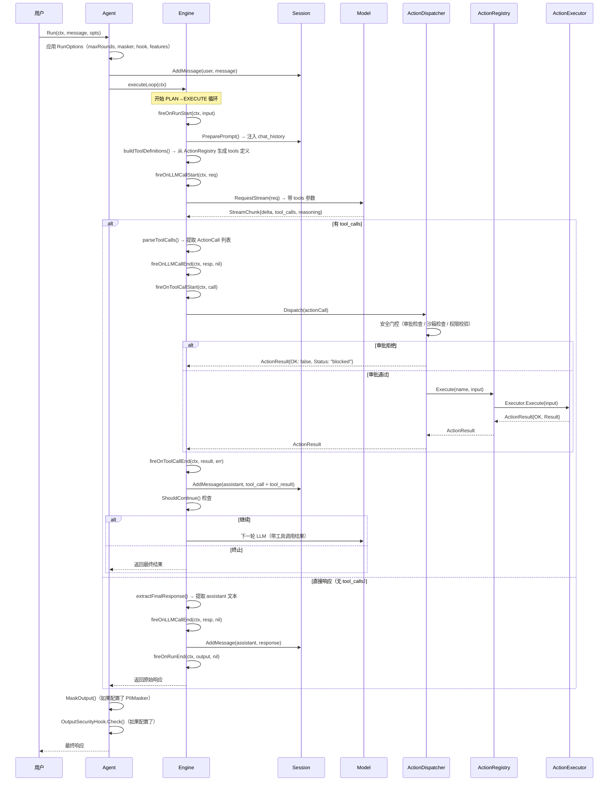

# 09 · 调用链全景分析

> 覆盖 Agent 主循环、13 条端到端调用链、错误传播路径与核心函数调用链
> 基于源码分析 + ARCHITECTURE.md 第 5 章编排层 + 第 9 章调用链

---

## 一、端到端 Agent 调用链

以下序列图展示 Agent 从用户输入到最终响应的完整执行流程，包含生命周期回调钩子：



### 生命周期回调总览

| 回调 | 触发时机 | 对应 OTel Span |
|------|---------|---------------|
| `OnRunStart` | `executeLoop` 开始前 | `SpanAgentRun` |
| `OnRunEnd` | `executeLoop` 结束后 | `SpanAgentRun` |
| `OnLLMCallStart` | LLM 请求发送前 | `SpanLLMCall` |
| `OnLLMCallEnd` | LLM 响应接收后 | `SpanLLMCall` |
| `OnToolCallStart` | Action 分发前 | `SpanToolCall` |
| `OnToolCallEnd` | Action 结果返回后 | `SpanToolCall` |
| `OnReasoning` | 收到推理内容块时 | — |
| `OnToken` | 收到每个文本 token 时 | — |
| `OnApprovalRequired` | 需要用户审批时 | — |
| `OnCompression` | 上下文窗口压缩后 | — |

### 循环控制条件

```go
func shouldContinue(decision Decision, roundIndex int, maxRounds int) bool {
    if maxRounds > 0 && roundIndex >= maxRounds {
        return false      // 达到最大轮数
    }
    if decision.NextAction != "execute" {
        return false      // LLM 决定直接回复
    }
    if !decision.UseAction {
        return false      // 不需要使用 action
    }
    return len(decision.ActionCalls) > 0  // 有可执行的 action
}
```

---

## 二、13 条端到端调用链

| 序号 | 调用链 | 涉及模块 | 说明 |
|:----:|--------|---------|------|
| 1 | 用户输入 → Agent → Session → Model → 响应 | session, model, orchestrator | **基础对话**：无工具调用的纯 LLM 问答 |
| 2 | 用户输入 → Agent → Session → Model → Action → 结果 → 下一轮 LLM → 响应 | session, model, action, orchestrator | **工具调用**：Agent 调用工具后继续推理 |
| 3 | Action → ActionDispatcher → 审批 → Sandbox → 执行 → 结果 | approval, sandbox, action | **沙箱执行**：经过审批和沙箱隔离的工具执行 |
| 4 | Flow → Step → StepFunc → FlowContext → 结果 | flow, schema | **Flow 执行**：线性 DAG 步骤编排 |
| 5 | Flow → TriggerFlow → Operator → SignalNet → 结果 | flow | **事件驱动**：基于信号网络的事件驱动流程 |
| 6 | Server → Agent → Flow → 结果 | server, flow, orchestrator | **REST API**：通过 HTTP 接口触发 Agent/Flow |
| 7 | Server → Trigger → Webhook/Cron/Event → Agent → 结果 | server, trigger | **外部触发**：Webhook 回调 / 定时任务 / 事件总线 |
| 8 | Server → SSE → StreamCallbacks → 流式结果 | server | **流式输出**：Server-Sent Events 实时推送 |
| 9 | CLI → REPL → Agent → 结果 | cli, orchestrator | **终端交互**：CLI 多轮对话模式 |
| 10 | CLI → MemoryBridge → Context → Session | cli, context, session | **记忆注入**：持久化记忆自动注入对话上下文 |
| 11 | Eval → Suite → ScriptedProvider → Agent → 断言 | eval, model, orchestrator | **离线评估**：基于预录响应的回放测试 |
| 12 | MCP → tools/list → ActionRegistry → 响应 | mcpserver, action | **MCP 协议**：标准 MCP 工具发现与调用 |
| 13 | Security → MessageHook → Session → Agent → OutputHook → 响应 | security, session, orchestrator | **安全链路**：输入侧 PII 脱敏/注入检测 + 输出侧安全校验 |

### 各调用链详细说明

#### 1. 基础对话链（序号 1）

```
用户输入 → Agent.Run() → Session.PreparePrompt() → Model.RequestStream()
    → 解析 StreamChunk → 提取文本 → Session.AddMessage() → 返回响应
```

最简路径，全程无工具调用。Agent 将用户消息加入 Session，构造 Prompt 后调用 LLM，解析流式响应后直接返回。

#### 2. 工具调用链（序号 2）

```
用户输入 → Agent.Run() → Session.PreparePrompt() → buildToolDefinitions()
    → Model.RequestStream(tools) → parseToolCalls()
    → ActionDispatcher.Dispatch() → ActionRegistry.Execute()
    → ActionResult → Session.AddMessage(tool_result)
    → 下一轮 LLM（带工具结果）→ ... → 最终响应
```

核心循环路径。LLM 返回工具调用请求后，Agent 分发执行、记录结果，并继续下一轮推理，直到 LLM 决定直接回复。

#### 3. 沙箱执行链（序号 3）

```
ActionDispatcher.Dispatch() → ApprovalManager.Check() → [审批通过]
    → SandboxExecutor.Execute() → sandbox.Provider.CreateHandle()
    → Handle.Execute(command) → ExecutionResult → ActionResult
```

仅在 `with_sandbox` build tag 下可用。Action 执行前经过审批检查，通过后由沙箱后端隔离执行。

#### 4. Flow 执行链（序号 4）

```
Flow.Execute(ctx, input) → 遍历 steps → 对每个 Step：
    StepFunc(ctx, input) → 可选 Schema 校验 → 输出传递给下一 Step
    → FlowContext.ExecuteAction() / GenerateModel() 横切调用
    → 最终结果
```

#### 5. 事件驱动链（序号 5）

```
TriggerFlow 启动 → SignalNet 信号分发 → Operator 链式处理
    → 算子类型：chunk / signal_gate / batch_fanout / match_case / ...
    → 结果聚合 → 输出
```

#### 6. REST API 链（序号 6）

```
POST /v1/chat/completions → Server 路由 → Agent.Run()
    → executeLoop / executeFlow → 结果返回
    → HTTP 200 JSON 响应
```

#### 7. 外部触发链（序号 7）

```
WebhookTrigger（HMAC 验签）| CronTrigger（定时）| EventTrigger（事件总线）
    → 触发 Agent 或 Flow 执行 → 结果返回
```

#### 8. 流式输出链（序号 8）

```
POST /v1/chat/completions (stream: true) → Server 路由
    → Agent.Run()(stream mode) → StreamChunk 通过 SSE 逐帧推送
    → ToolStreamEvent{step_done / tool_call / tool_result}
```

#### 9. CLI 终端交互链（序号 9）

```
CLI 启动 → REPL 循环 → 读取用户输入 → Agent.Run()
    → 结果渲染 → 等待下一轮输入
    → 内置命令：/help /memory /compact /quit
```

#### 10. 记忆注入链（序号 10）

```
CLI 启动 → MemoryBridge 初始化 → HybridManager 加载持久化记忆
    → 三区（Hot / Warm / Cold）注入 → Session 上下文中生效
    → 用户感知到历史记忆
```

#### 11. 离线评估链（序号 11）

```
Eval.Runner.RunSuite() → 遍历 Cases
    → 使用 ScriptedProvider（预录响应）替代真实 LLM
    → Agent.Run() → 断言检查（Contains / NotContains / ToolSequence）
    → 输出评估报告
```

#### 12. MCP 协议链（序号 12）

```
MCP 客户端请求 tools/list → MCPServer 路由
    → ActionRegistry.List() → 返回 Action 列表（JSON-RPC 2.0）
    → tools/call → ActionRegistry.Execute() → 返回结果
```

支持三种传输协议：StdioTransport / SSETransport / StreamableHTTPTransport。

#### 13. 安全链路（序号 13）

```
输入 → MessageHook（PII 脱敏 + Prompt 注入检测）
    → Session.AddMessage() → Agent.Run() → executeLoop
    → 输出 → OutputSecurityHook（输出注入检测 + 输出脱敏）
    → 最终响应
```

四级严重度：Critical / High / Medium / Low。检测到高危注入时直接阻断请求。

---

## 三、错误传播

| 错误类型 | 源头 | 传播路径 | 处理方式 |
|---------|------|---------|---------|
| LLM 超时 | model | → engine → agent | 记录错误，触发重试 |
| Action 执行错误 | action | → dispatcher → engine | 记录错误，继续执行 |
| 审批拒绝 | approval | → dispatcher → engine | 标记 `blocked`，返回结果 |
| 沙箱错误 | sandbox | → executor → dispatcher → engine | 标记 `error`，返回错误 |
| 注入检测 | security | → hook → session / agent | 阻断请求 / 记录告警 |
| 死循环 | loopGuard | → engine | 终止循环，返回已收集结果 |
| 流超时 | engine | → executeLoop | 超时退出，返回截止前结果 |
| 上下文溢出 | session | → resizeHandler → session | 触发压缩策略，记录 `OnCompression` |
| Pause 信号 | flow | → flowContext → step | 暂停执行，保存 Checkpoint |

### 错误处理策略

| 策略 | 适用场景 | 实现 |
|------|---------|------|
| **重试** | LLM 超时 / 临时网络错误 | `FailoverModelRequester` 自动故障转移 |
| **继续** | Action 执行错误（不影响整体流程） | 记录错误到 Session，下一轮 LLM 可感知 |
| **阻断** | 审批拒绝 / 注入检测高危 | 立即返回 `blocked` 状态，不继续执行 |
| **终止** | 死循环 / 达到最大轮数 | `LoopGuard` 或 `shouldContinue` 检查触发 |
| **暂停** | 人工干预 / Checkpoint 到达 | 序列化当前状态到 `FileCheckpointStore` |
| **压缩** | 上下文窗口溢出 | `ResizeHandler` 策略执行裁剪 |

### LoopGuard 死循环检测配置

```go
type LoopGuardConfig struct {
    MaxConsecutiveIdenticalActions int  // 连续相同 Action 上限，默认 3
    MaxConsecutiveErrors           int  // 连续错误上限，默认 5
    MaxTotalRounds                 int  // 总轮数上限，默认 20
    // ...
}
```

### 三种取消安全点

| 安全点 | 触发时机 | 行为 |
|--------|---------|------|
| LLM 调用前 | `executeLoop` 开始 | 检查 `ctx.Done()` |
| Action 执行前 | `Dispatcher.Execute` | 检查 `ctx.Done()` |
| 状态更新前 | 每轮迭代结束 | 检查 `ctx.Done()` |

---

## 四、核心函数调用链

以下使用 Go 风格箭头表示法展示各主要路径的函数调用序列。

### 基础对话链

```
Agent.Run()
  └─ Engine.executeLoop()
       ├─ fireOnRunStart()
       ├─ Session.PreparePrompt()
       │    ├─ 注入 chat_history
       │    └─ 注入 system_prompt
       ├─ buildToolDefinitions()
       │    └─ ActionRegistry.List() → []ToolDefinition
       ├─ fireOnLLMCallStart()
       ├─ Model.RequestStream()
       │    └─ parseStream()
       │         ├─ parseStreamChunk() → delta / tool_calls / reasoning
       │         └─ fireOnReasoning() / fireOnToken()
       ├─ extractFinalResponse()
       ├─ fireOnLLMCallEnd()
       ├─ Session.AddMessage(assistant, response)
       ├─ fireOnRunEnd()
       └─ return result
```

### 工具调用链

```
Agent.Run()
  └─ Engine.executeLoop()
       ├─ Session.PreparePrompt()
       ├─ buildToolDefinitions()
       ├─ fireOnLLMCallStart()
       ├─ Model.RequestStream(tools)
       │    └─ parseToolCalls() → []ActionCall
       ├─ fireOnLLMCallEnd()
       │
       ├─ loop ≥ 1 轮：
       │    ├─ fireOnToolCallStart()
       │    ├─ ActionDispatcher.Dispatch(actionCall)
       │    │    ├─ ApprovalManager.Check()       // 审批门控
       │    │    ├─ [with_sandbox] Sandbox 检查    // 沙箱门控
       │    │    └─ ActionRegistry.Execute()
       │    │         └─ ActionExecutor.Execute()
       │    │              └─ return ActionResult
       │    ├─ fireOnToolCallEnd()
       │    ├─ Session.AddMessage(tool_result)
       │    ├─ shouldContinue() 检查
       │    │    ├─ maxRounds 上限
       │    │    ├─ LoopGuard 死循环检测
       │    │    └─ ctx.Done() 取消检查
       │    │
       │    ├─ [继续] → Model.RequestStream()     // 下一轮
       │    └─ [终止] → return result
       │
       ├─ extractFinalResponse()
       └─ return result
```

### Flow 执行链

```
Agent.Run()
  └─ executeFlow()
       └─ Flow.Execute(ctx, input)
            ├─ 注入 FlowContext（flowContextImpl）
            │    ├─ Engine          → GenerateModel() / RunAgent()
            │    ├─ SessionExtension → SessionHistory() / AppendSession()
            │    ├─ ActionExtension  → ExecuteAction()
            │    └─ AuditHook        → AuditAppend()
            │
            ├─ 遍历 edges：
            │    └─ Step.Func(ctx, input)
            │         ├─ [可选] Schema 校验
            │         ├─ 横切调用（FlowContext 接口）
            │         │    ├─ ExecuteAction()  → ActionRuntime
            │         │    ├─ GenerateModel()  → Model.RequestStream()
            │         │    ├─ RunAgent()       → 子 Agent 执行
            │         │    ├─ RunAgentParallel() → 并行子 Agent
            │         │    ├─ AuditAppend()    → 审计链记录
            │         │    ├─ MaskInput()      → 输入脱敏
            │         │    ├─ CheckOutput()    → 输出校验
            │         │    └─ RequestPause()   → 暂停信号
            │         ├─ 输出传递给下一 Step
            │         └─ [Pause 信号] → 保存 Checkpoint → 返回
            │
            └─ return result
```

### Action 执行链（含沙箱）

```
ActionDispatcher.Dispatch(call)
  ├─ ApprovalManager.Check()
  │    ├─ AutoAllowHandler       → 自动放行
  │    ├─ AutoApproveHandler     → 自动批准
  │    ├─ FailClosedHandler      → 默认拒绝
  │    └─ InputTimeoutFailHandler → 超时拒绝
  │
  ├─ [审批拒绝] → ActionResult{OK: false, Status: "blocked"}
  │
  └─ [审批通过]
       └─ ActionRegistry.Execute(name, input)
            └─ ActionExecutor.Execute(input)
                 ├─ [LocalFunctionExecutor]
                 │    └─ func(ctx, input) (output, error)  // 三种签名自动包装
                 │
                 ├─ [MCPExecutor]
                 │    └─ MCP 客户端 → tools/call → JSON-RPC 响应
                 │
                 └─ [SandboxExecutor] (with_sandbox)
                      └─ sandbox.Provider.CreateHandle()
                           ├─ DockerProvider     → Docker 容器
                           ├─ LocalProvider      → 本地进程
                           ├─ TrustedLocalProvider → 命令白名单
                           ├─ E2BProvider        → 远程沙箱
                           └─ ...
                           └─ Handle.Execute(command)
                                └─ ExecutionResult → ActionResult
```

### 安全链路

```
用户输入
  ├─ [MessageHook]  → security/sessionhook
  │    ├─ PIIMasker.Mask()          → 5 种脱敏模式
  │    └─ PromptInjectionDetector   → 三级严重度检测
  │         ├─ Critical → 阻断
  │         ├─ High     → 阻断 + 告警
  │         └─ Medium/Low → 记录 + 放行
  │
  └─ Session.AddMessage()
       └─ Agent.Run()
            └─ OutputSecurityHook.Check()  → security/agenthook
                 ├─ OutputInjectionDetector
                 └─ OutputMasker
                      └─ 最终响应
```

### Server REST API 链

```
POST /v1/chat/completions
  └─ Server.ServeHTTP()
       ├─ 路由匹配
       ├─ 请求解析 + 租户识别
       ├─ Agent.Run() / executeFlow()
       └─ 响应序列化
            ├─ [非流式] → JSON 200
            └─ [流式]   → SSE 逐帧推送
                 ├─ StreamCallbacks.OnToken
                 └─ ToolStreamEvent{step_done / tool_call / tool_result}
```

### MCP 协议链

```
MCP 客户端请求
  ├─ tools/list
  │    └─ MCPServer 路由
  │         └─ ActionRegistry.List()
  │              └─ JSON-RPC 响应：[]ToolDefinition
  │
  └─ tools/call
       └─ MCPServer 路由
            └─ ActionRegistry.Execute(name, args)
                 └─ ActionExecutor.Execute()
                      └─ JSON-RPC 响应：ActionResult
```

### Eval 评估链

```
Eval.Runner.RunSuite()
  └─ 遍历 Suite.Cases[]
       ├─ 创建 ScriptedProvider（预录响应回放）
       ├─ Agent.Run()
       │    └─ ScriptedProvider.RequestStream() → 返回预录流
       ├─ 断言检查
       │    ├─ Contains → 检查输出是否包含子串
       │    ├─ NotContains → 检查输出是否不包含子串
       │    └─ ToolSequence → 检查工具调用顺序
       └─ 汇总评估报告
```

---

## 附录：调用链矩阵

| 调用链 | 入口 | 出口 | 同步/异步 | 涉及模块数 | 关键风险点 |
|--------|------|------|----------|-----------|-----------|
| 基础对话 | Agent.Run() | 文本响应 | 同步 | 3 | LLM 超时 |
| 工具调用 | Agent.Run() | 文本响应 | 同步 | 4 | 无限循环 |
| 沙箱执行 | ActionDispatcher | ActionResult | 同步 | 3 | 沙箱逃逸 |
| Flow 执行 | Flow.Execute() | any | 同步 | 2 | Step 死锁 |
| 事件驱动 | TriggerFlow | any | 异步 | 1 | 信号丢失 |
| REST API | Server.HTTP | JSON | 同步 | 3 | 连接中断 |
| 外部触发 | Trigger | any | 异步 | 2 | 触发丢失 |
| 流式输出 | Server.SSE | SSE stream | 流式 | 1 | 连接中断 |
| 终端交互 | CLI.REPL | 文本 | 同步 | 2 | 输入阻塞 |
| 记忆注入 | MemoryBridge | Session | 同步 | 3 | 记忆膨胀 |
| 离线评估 | Eval.Runner | 报告 | 同步 | 3 | 断言不准确 |
| MCP 协议 | MCP Client | JSON-RPC | 同步/流式 | 2 | 协议不兼容 |
| 安全链路 | MessageHook | 响应 | 同步 | 3 | 误报率 |