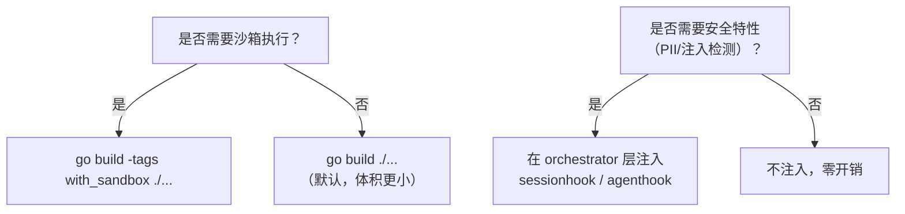

# 11 · 可插拔架构

## 一、编译配置决策树

Inferglow 的可插拔架构体现在两个维度：**编译时**通过 Build Tag 裁减功能，**运行时**通过接口注入按需启用安全特性。以下决策树展示了两种维度的选择逻辑：



> 沙箱和安全特性是正交的，可以独立选择。例如：可以启用沙箱但不启用安全特性，也可以反之。

## 二、Build Tags 机制

沙箱功能通过 `//go:build` 条件编译标签实现可选编译。`action` 模块包含两个文件，在编译时根据标签选择生效的实现：

**`action/executor_sandbox.go`** — 启用沙箱时的完整实现：

```go
//go:build with_sandbox

package action

import "github.com/inferglow/sandbox"

// SandboxExecutor 在沙箱中执行 Action。
type SandboxExecutor struct {
    provider sandbox.Provider
    config   SandboxExecutorConfig
}

type SandboxExecutorConfig struct {
    ProviderType string
    Timeout      time.Duration
    AllowedPaths []string
    Network      bool
}

// NewSandboxExecutor 创建沙箱执行器，包含完整的沙箱逻辑。
func NewSandboxExecutor(config SandboxExecutorConfig) *SandboxExecutor {
    return &SandboxExecutor{
        config: config,
    }
}

func (e *SandboxExecutor) Execute(ctx context.Context, cmd Command) (ActionResult, error) {
    handle, err := e.provider.CreateHandle(ctx, sandbox.ExecutionPolicy{
        Timeout:      e.config.Timeout,
        AllowedPaths: e.config.AllowedPaths,
        Network:      e.config.Network,
    })
    if err != nil {
        return ActionResult{}, err
    }
    defer handle.Close()

    result, err := handle.Execute(ctx, sandbox.Command{
        Command: cmd.Command,
        Args:    cmd.Args,
        Env:     cmd.Env,
    })
    return ActionResult{OK: result.ExitCode == 0, Result: result.Stdout}, err
}
```

**`action/executor_sandbox_stub.go`** — 未启用沙箱时的占位实现：

```go
//go:build !with_sandbox

package action

import "errors"

// NewSandboxExecutor 在未启用沙箱时返回占位对象。
// 该对象在 Execute 被调用时会返回错误，提示用户重新编译。
func NewSandboxExecutor(config SandboxExecutorConfig) *SandboxExecutor {
    return &SandboxExecutor{config: config}
}

func (e *SandboxExecutor) Execute(ctx context.Context, cmd Command) (ActionResult, error) {
    return ActionResult{}, errors.New(
        "sandbox executor not available: recompile with -tags with_sandbox",
    )
}
```

> 通过这种机制，未启用沙箱的编译产物体积更小、依赖更少，且运行时的错误提示清晰，引导用户在需要时重新编译。

## 三、接口注入模式

安全特性（PII 脱敏、Prompt 注入检测、输出安全检测）采用**接口注入**模式。`session` 和 `orchestrator/agent` 对 `security` 完全无感知——它们只依赖接口，不关心实现方是谁。不注入时为零开销。

```
session 和 orchestrator/agent 对 security 完全无感知，不注入即零开销。
```

**启用安全特性（无需特殊编译）：**

```go
// 创建安全钩子
secHook := sessionhook.NewSecurityHook(
    sessionhook.WithPIIMasking(pii.DefaultMasker()),
    sessionhook.WithPromptInjectionDetector(detector.Default()),
)

// 在 Session 层面注入 MessageHook
sess := session.NewSessionWithOptions("session-id", 4000,
    session.WithSecurityHook(secHook),
)

// 在 Agent 层面注入输出安全钩子和 PII 脱敏器
ag := agent.New(sess, actExt, llm,
    agent.WithOutputSecurityHook(agenthook.NewOutputHook()),
    agent.WithPIIMasker(agenthook.NewPIIMasker(pii.DefaultMasker())),
)
```

**不注入时的默认行为（零开销）：**

```go
// 不注入任何安全钩子，session 和 agent 正常工作
sess := session.NewSessionWithOptions("session-id", 4000)
ag := agent.New(sess, actExt, llm)
```

三个注入接口的契约定义：

| 接口 | 定义位置 | 默认行为 | 注入后效果 |
|------|---------|---------|-----------|
| `session.MessageHook` | `session/` | 透传，不修改消息 | 对每条消息做 PII 脱敏 + 注入检测 |
| `agent.OutputSecurityHook` | `orchestrator/agent/` | 透传，不检查输出 | 对 Agent 输出做安全检测 |
| `agent.PIIMasker` | `orchestrator/agent/` | 透传，不脱敏 | 对最终输出做 PII 脱敏 |

## 四、扩展点清单

Inferglow 在关键抽象处定义了 7 种接口扩展点，每种都有默认实现和可选实现，用户可自由替换：

| 扩展点 | 接口 | 默认实现 | 可选实现 |
|--------|------|---------|---------|
| LLM Provider | `model.ModelRequester` | OpenAI | Anthropic, Ollama, vLLM, Failover, ModelPool |
| Action Executor | `action.ActionExecutor` | LocalFunction | MCP, Sandbox |
| 上下文裁剪 | `session.ResizeHandler` | SimpleCut | SummaryFirst, TokenAware, SmartCompress |
| 沙箱后端 | `sandbox.Provider` | Local | Docker, gVisor, E2B, Windows, TrustedLocal, Seatbelt |
| 重排序 | `rerank.Reranker` | Cohere | LLM-based, Fallback |
| 审批策略 | `approval.ApprovalHandler` | AutoAllow | AutoApprove, FailClosed, InputTimeout |
| 审计 | `audit.AuditHook` | MemoryAudit | 可自定义 |

## 五、模块化与可替换性

### 5.1 23 个独立 Go Module

Inferglow 由 23 个独立的 Go module 构成，每个 module 拥有独立的 `go.mod`，可独立发布、测试、演进。Graphify 知识图谱分析确认无循环依赖。

每个模块的依赖关系严格遵循单向分层：

```
应用层  →  编排层  →  中间层  →  基础层
（server, cli）  （orchestrator, security）  （flow, action）  （model, schema, sandbox…）
```

### 5.2 模块替换方式

替换某个模块只需修改 `go.mod` 中的 `replace` 指令，无需改动上层代码。例如，将 LLM Provider 抽象 `model` 模块替换为自定义实现：

```
// go.mod — 替换 model 模块为自定义版本
replace github.com/inferglow/model => github.com/your-org/model v1.2.0
```

### 5.3 独立演进能力

每个模块可在自己的版本线上独立演进：

| 模块 | 当前预估 LOC | 演进方向 |
|------|-------------|---------|
| `model` | ~8000 | 新增 Provider（如 Google Vertex AI） |
| `sandbox` | ~6300 | 新增沙箱后端（如 Firecracker） |
| `flow` | ~7400 | 新增算子类型 |
| `orchestrator` | ~7700 | Multi-Agent 协作 |
| `security` | ~2000 | 新增检测规则 |

### 5.4 接口契约保障

模块间通过 Go interface 通信，接口变更遵循语义化版本控制：

```go
// 模块提供方保证向后兼容
// 模块消费方只依赖接口，不依赖实现
type ModelRequester interface {
    RequestModel(ctx context.Context, req *ModelRequest) (*ModelResponse, error)
}
```

这种设计使得：
- 替换 LLM Provider 不需要改动 `orchestrator` 或 `flow` 的任何代码
- 替换沙箱后端不需要改动 `action` 的执行逻辑
- 替换上下文裁剪策略不需要改动 `session` 的记忆管理